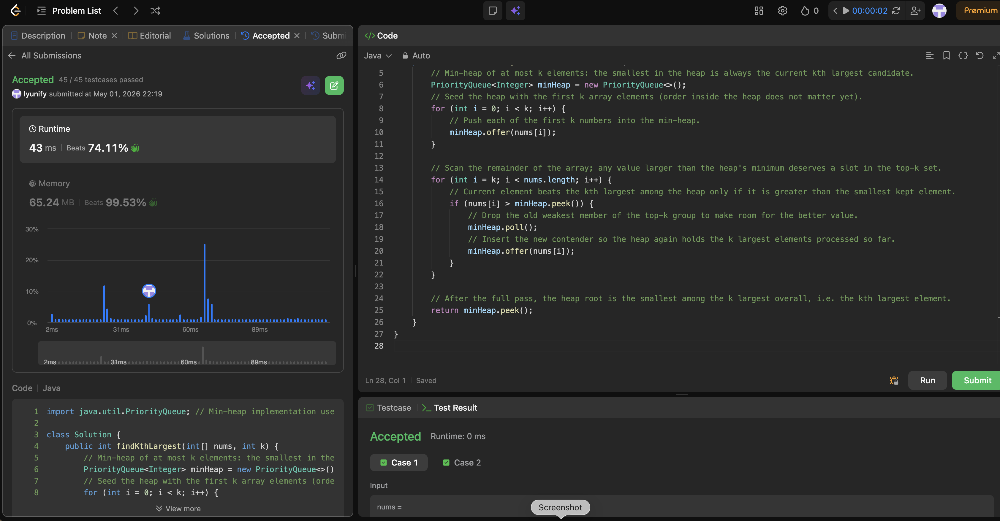

# 215. Kth Largest Element in an Array

**Difficulty**: Medium<br>
**Primary Tag**: heap<br>
**Secondary Tags**: array, sorting<br>
**LeetCode Link**: https://leetcode.com/problems/kth-largest-element-in-an-array/

---

## Problem Summary

Given an integer array and an integer k, return the kth largest element in the array (not the kth distinct element).

## Screenshot



---

## My Mistake(s)

- Used a max-heap and tried to pop k−1 times to get the kth largest — works but is clumsy and easy to miscount when k is 1 or n.
- Confused "kth largest" with "kth smallest" and compared the wrong way against `peek()`.
- Initialized an empty heap and offered everything without bounding size, then wondered how to extract the kth largest from n elements in O(log n) per push — that is the wrong structure unless you pop extra.
- Forgot that `PriorityQueue` in Java is a min-heap by default for integers.
- Sometimes used quickselect mentally but implemented partition boundaries wrong (equal elements, pivot choice) when the prompt only asked for a clean heap solution.

## Key Insight

The kth largest is the smallest value inside the set of the k largest numbers in the array. Maintain a **min-heap of size k**: its root is exactly that "smallest among the top k." Fill the heap with the first k elements, then for each later element, if it beats the heap minimum, evict the root and insert the new value. After one pass, `peek()` is the answer.

Intuition: you never need to remember more than k "winners," and the weakest winner sits at the top of a min-heap. Time is O(n log k) with O(k) extra space; sorting would be O(n log n).

## Correct Approach

1. Create a min-heap (`PriorityQueue` default in Java).
2. Add the first k elements directly.
3. For each remaining element: if `nums[i] > minHeap.peek()`, call `poll()` then `offer(nums[i])`.
4. Return `minHeap.peek()`.

```java
import java.util.PriorityQueue;

class Solution {
    public int findKthLargest(int[] nums, int k) {
        // Min-heap of at most k elements; root = current kth largest candidate
        PriorityQueue<Integer> minHeap = new PriorityQueue<>();

        // Seed the heap with the first k elements
        for (int i = 0; i < k; i++) {
            minHeap.offer(nums[i]);
        }

        // For remaining elements, replace the root if the new value is larger
        for (int i = k; i < nums.length; i++) {
            if (nums[i] > minHeap.peek()) {
                minHeap.poll();
                minHeap.offer(nums[i]);
            }
        }

        // Root is the smallest of the k largest = kth largest overall
        return minHeap.peek();
    }
}
```

**Time Complexity**: O(n log k)<br>
**Space Complexity**: O(k)

---

## Practice History

| Date | Outcome | Notes |
|------|---------|-------|
| 2026-05-01 | ✅ Solved after review | Min-heap of size k; confused max-heap approach and forgot Java PriorityQueue is min-heap by default |
