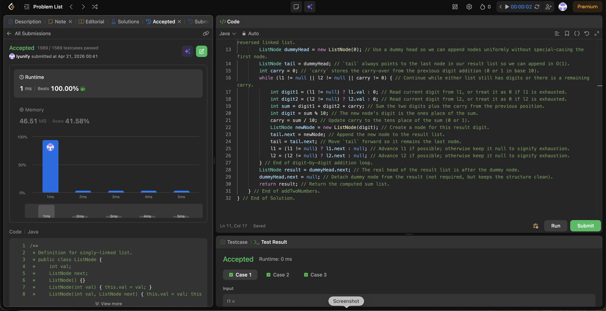

# 2. Add Two Numbers

**Difficulty**: Medium<br>
**Primary Tag**: linked-list<br>
**Secondary Tags**: math, recursion<br>
**LeetCode Link**: https://leetcode.com/problems/add-two-numbers/

---

## Problem Summary

Given two non-empty linked lists representing two non-negative integers stored in reverse order, return the sum as a linked list in the same reverse order.

## Screenshot



---

## My Mistake(s)

- Forgetting to keep looping when there is a remaining carry, leading to a missing most-significant digit.
- Advancing l1/l2 without null checks, which can cause null pointer errors when lists have different lengths.
- Mixing up the meaning of `%` and `/` in base-10 addition (digit vs carry).

## Key Insight

- Use a dummy head + tail pointer to avoid special-casing the first node and keep appends O(1).
- The loop condition must include `carry != 0`, otherwise you can miss the final carry node (e.g., 5 + 5 → 0 with carry 1).
- Treat missing digits as 0 when one list is shorter: `digit = (node != null) ? node.val : 0`.
- Update order matters: compute `sum`, derive `digit = sum % 10`, then `carry = sum / 10`, then append the node.

## Correct Approach

1. Create a `dummyHead` node; keep a `tail` pointer for O(1) appends.
2. Loop while `l1 != null || l2 != null || carry != 0`.
3. Read each digit as `(node != null) ? node.val : 0`.
4. Compute `sum = digit1 + digit2 + carry`, then `digit = sum % 10`, `carry = sum / 10`.
5. Append a new node with `digit`; advance `l1`/`l2` only if non-null.
6. Return `dummyHead.next`.

```java
public ListNode addTwoNumbers(ListNode l1, ListNode l2) {
    ListNode dummyHead = new ListNode(0);
    ListNode tail = dummyHead;
    int carry = 0;
    while (l1 != null || l2 != null || carry != 0) {
        int digit1 = (l1 != null) ? l1.val : 0;
        int digit2 = (l2 != null) ? l2.val : 0;
        int sum = digit1 + digit2 + carry;
        int digit = sum % 10;
        carry = sum / 10;
        tail.next = new ListNode(digit);
        tail = tail.next;
        l1 = (l1 != null) ? l1.next : null;
        l2 = (l2 != null) ? l2.next : null;
    }
    return dummyHead.next;
}
```

**Time Complexity**: O(max(m, n))<br>
**Space Complexity**: O(max(m, n))

---

## Practice History

| Date | Outcome | Notes |
|------|---------|-------|
| 2026-04-21 | ✅ Solved after review | Missed carry loop condition and null-check advancing; mixed up % vs / |
