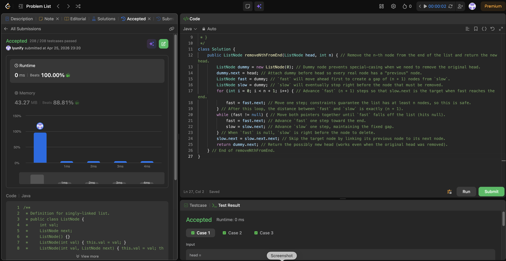

# 19. Remove Nth Node From End of List

**Difficulty**: Medium<br>
**Primary Tag**: linked-list<br>
**Secondary Tags**: two-pointers<br>
**LeetCode Link**: https://leetcode.com/problems/remove-nth-node-from-end-of-list/

---

## Problem Summary

Given the head of a linked list, remove the n-th node from the end of the list and return the new head.

## Screenshot



---

## My Mistake(s)

- Advancing `fast` only `n` steps and then needing extra branching for "remove head", which makes edge cases easier to mess up.
- Using `while (fast.next != null)` in some variants and deleting the wrong node due to off-by-one confusion (target vs predecessor).
- Forgetting that we need the **previous node** of the target to delete it in a singly linked list.
- Not using a dummy node and then returning the wrong head when the first node is removed.

## Key Insight

- A **dummy node** avoids special-casing when the node to remove is the original head.
- Keep a **fixed gap of n+1** between `fast` and `slow`; when `fast` reaches `null`, `slow` is exactly one node before the target.
- The deletion is just one pointer change: `slow.next = slow.next.next`, making the whole algorithm **one pass** with O(1) extra space.
- The invariant ("slow is always behind fast by n+1 nodes") is the key to reasoning about correctness.

## Correct Approach

1. Create a dummy node pointing to head — this gives every real node a "previous" node.
2. Initialize both `fast` and `slow` at dummy.
3. Advance `fast` exactly `n + 1` steps so the gap between `fast` and `slow` is `n + 1`.
4. Move both pointers together until `fast == null`. Now `slow` is right before the target.
5. Delete the target: `slow.next = slow.next.next`.
6. Return `dummy.next` (handles removal of original head cleanly).

```java
class Solution {
    public ListNode removeNthFromEnd(ListNode head, int n) {
        ListNode dummy = new ListNode(0);
        dummy.next = head;
        ListNode fast = dummy;
        ListNode slow = dummy;
        for (int i = 0; i < n + 1; i++) {
            fast = fast.next;
        }
        while (fast != null) {
            fast = fast.next;
            slow = slow.next;
        }
        slow.next = slow.next.next;
        return dummy.next;
    }
}
```

**Time Complexity**: O(L) — single pass, where L is the list length<br>
**Space Complexity**: O(1)

---

## Practice History

| Date | Outcome | Notes |
|------|---------|-------|
| 2026-04-25 | ✅ | Solved after review — off-by-one on fast advance; remembered dummy node trick |
