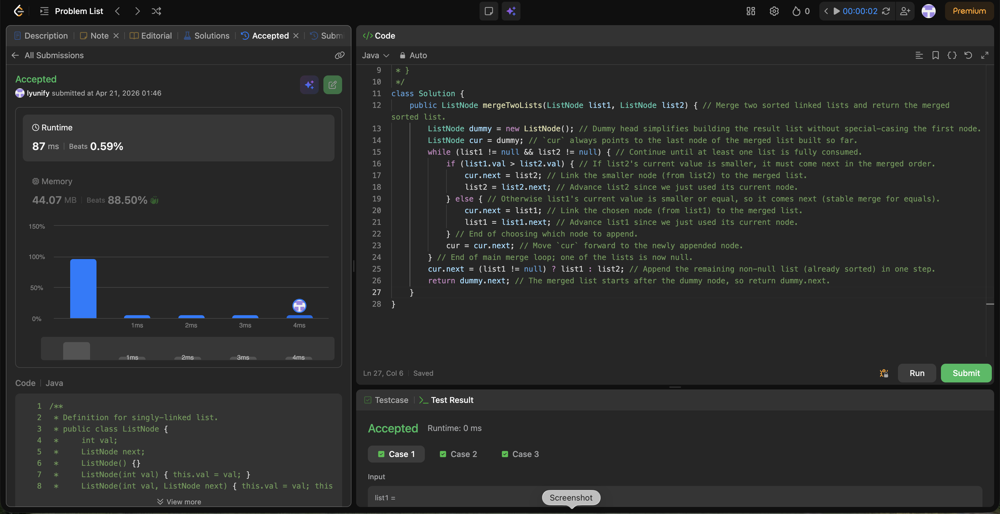

# 21. Merge Two Sorted Lists

**Difficulty**: Easy<br>
**Primary Tag**: linked-list<br>
**Secondary Tags**: recursion<br>
**LeetCode Link**: https://leetcode.com/problems/merge-two-sorted-lists/

---

## Problem Summary

Given the heads of two sorted linked lists, merge them into one sorted linked list and return its head.

## Screenshot



---

## My Mistake(s)

- Forgetting to advance `cur` after linking a node, causing an infinite loop or overwritten links.
- Advancing the wrong input pointer (e.g., moving `list1` after attaching `list2`), which loses nodes or breaks ordering.
- Using `while (list1 != null || list2 != null)` without careful null handling, leading to null pointer errors on `.val`.
- Not appending the leftover list at the end (missing nodes), or trying to continue comparing after one list is exhausted.

## Key Insight

- A dummy head lets you build the merged list uniformly without special-casing the first node.
- Keep a `cur` pointer always pointing to the last node of the merged list; each step appends exactly one node and advances one input pointer.
- When one list becomes null, attach the remaining list directly — it is already sorted.
- Choosing `list1` when values are equal makes the merge stable (relative order of equal elements from `list1` is preserved).

## Correct Approach

1. Create a `dummy` node; set `cur = dummy`.
2. Loop while both lists are non-null:
   - If `list1.val > list2.val`, link `cur.next = list2` and advance `list2`.
   - Else link `cur.next = list1` and advance `list1`.
   - Advance `cur = cur.next`.
3. Attach the non-null remainder: `cur.next = (list1 != null) ? list1 : list2`.
4. Return `dummy.next`.

```java
public ListNode mergeTwoLists(ListNode list1, ListNode list2) {
    ListNode dummy = new ListNode(0);
    ListNode cur = dummy;
    while (list1 != null && list2 != null) {
        if (list1.val > list2.val) {
            cur.next = list2;
            list2 = list2.next;
        } else {
            cur.next = list1;
            list1 = list1.next;
        }
        cur = cur.next;
    }
    cur.next = (list1 != null) ? list1 : list2;
    return dummy.next;
}
```

**Time Complexity**: O(m + n)<br>
**Space Complexity**: O(1)

---

## Practice History

| Date | Outcome | Notes |
|------|---------|-------|
| 2026-04-21 | ✅ Solved after review | Forgot to advance cur; used \|\| instead of && in loop condition; missed leftover attachment |
