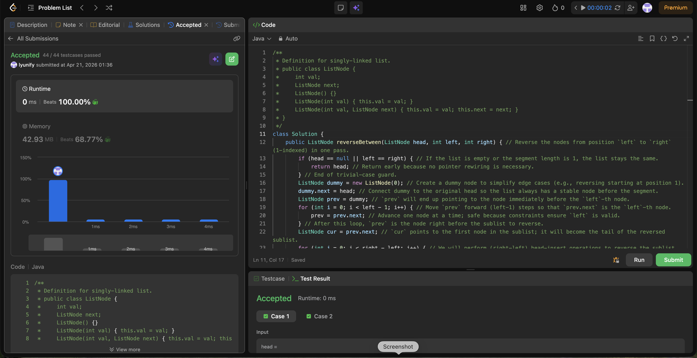

# 92. Reverse Linked List II

**Difficulty**: Medium<br>
**Primary Tag**: linked-list<br>
**Secondary Tags**: <!-- none --><br>
**LeetCode Link**: https://leetcode.com/problems/reverse-linked-list-ii/

---

## Problem Summary

Given the head of a singly linked list and two integers `left` and `right`, reverse the nodes from position `left` to `right` (1-indexed) in one pass and return the modified list.

## Screenshot



---

## My Mistake(s)

- Confusing pointer roles (`prev`, `cur`, `temp`) and accidentally moving `cur` forward — it must stay fixed as the tail during head-insert reversal.
- Off-by-one errors when positioning `prev` (it must stop at the node just before `left`).
- Forgetting to reconnect links after extracting `temp`: missing `cur.next = temp.next` can create cycles or lose nodes.
- Not using a dummy node, which complicates the case when `left == 1` and can lead to returning the wrong head.

## Key Insight

- The dummy node pattern makes reversing from position 1 painless — you always have a stable "node before the segment".
- The **head-insertion technique** reverses the sublist in-place by repeatedly taking `cur.next` and inserting it right after `prev`.
- Invariant: `prev.next` is always the current head of the reversed part; `cur` stays fixed as the tail (the original first node of the segment).
- The loop runs exactly `(right - left)` times → O(n) time, O(1) space.

## Correct Approach

1. Create a `dummy` node; set `dummy.next = head`.
2. Advance `prev` exactly `left - 1` steps so it points to the node just before the segment.
3. Set `cur = prev.next` (the tail of the reversed portion — it never moves).
4. Repeat `(right - left)` times:
   - `temp = cur.next`
   - `cur.next = temp.next`
   - `temp.next = prev.next`
   - `prev.next = temp`
5. Return `dummy.next`.

```java
public ListNode reverseBetween(ListNode head, int left, int right) {
    if (head == null || left == right) return head;
    ListNode dummy = new ListNode(0);
    dummy.next = head;
    ListNode prev = dummy;
    for (int i = 0; i < left - 1; i++) {
        prev = prev.next;
    }
    ListNode cur = prev.next;
    for (int i = 0; i < right - left; i++) {
        ListNode temp = cur.next;
        cur.next = temp.next;
        temp.next = prev.next;
        prev.next = temp;
    }
    return dummy.next;
}
```

**Time Complexity**: O(n)<br>
**Space Complexity**: O(1)

---

## Practice History

| Date | Outcome | Notes |
|------|---------|-------|
| 2026-04-21 | ✅ Solved after review | Mixed up pointer roles; off-by-one on prev positioning; forgot dummy node for left==1 case |
