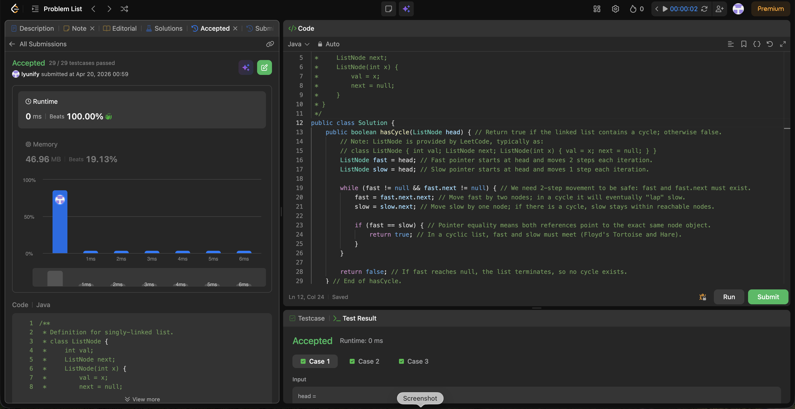

# 141. Linked List Cycle

**Difficulty**: Easy<br>
**Primary Tag**: linked-list<br>
**Secondary Tags**: two-pointers<br>
**LeetCode Link**: https://leetcode.com/problems/linked-list-cycle/

---

## Problem Summary

Given the head of a linked list, determine if the list contains a cycle. Return `true` if there is a cycle, otherwise `false`.

## Screenshot



---

## My Mistake(s)

- Wrote the loop condition incorrectly (e.g., only checking `fast != null`), which causes a null-pointer crash when doing `fast.next.next`.
- Initially misunderstood the comparison and tried to compare node values; the correct check is whether the two pointers refer to the same node object (`fast == slow`).
- Sometimes forgot that an empty list or single-node non-cyclic list should return `false` immediately — the while-guard `fast != null && fast.next != null` handles this naturally.

## Key Insight

Floyd's Tortoise and Hare works because the fast pointer moves 2× speed; in a cycle it must eventually catch up to the slow pointer (same node reference). The loop guard `fast != null && fast.next != null` is the exact safety condition needed for a 2-step move (`fast.next.next`) without a null dereference. Comparing nodes must use reference equality (`fast == slow`), not value equality, since the meeting point is about node identity.

## Correct Approach

Initialize both `fast` and `slow` at `head`. Each iteration advance `fast` by two nodes and `slow` by one. If they ever point to the same node, a cycle exists — return `true`. If `fast` reaches `null`, the list terminates with no cycle — return `false`.

```java
public boolean hasCycle(ListNode head) {
    ListNode fast = head;
    ListNode slow = head;

    while (fast != null && fast.next != null) {
        fast = fast.next.next;
        slow = slow.next;

        if (fast == slow) {
            return true;
        }
    }

    return false;
}
```

**Time Complexity**: O(n)<br>
**Space Complexity**: O(1)

---

## Practice History

| Date | Outcome | Notes |
|------|---------|-------|
| 2026-04-20 | Solved after review | Wrong loop guard; confused reference vs value equality for meeting-point check |
