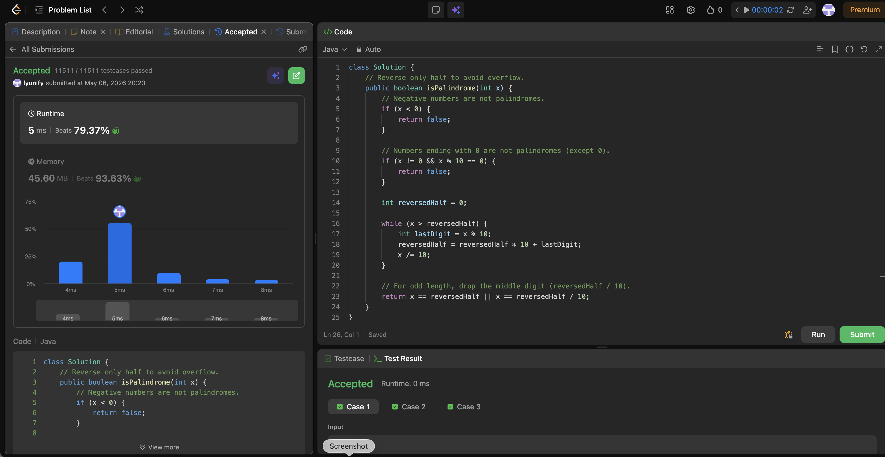

# 9. Palindrome Number

**Difficulty**: Easy<br>
**Primary Tag**: math<br>
**Secondary Tags**: <!-- none --><br>
**LeetCode Link**: https://leetcode.com/problems/palindrome-number/

---

## Problem Summary

Given an integer `x`, return `true` if it reads the same forward and backward, otherwise return `false`.

## Screenshot



---

## My Mistake(s)

Considered reversing the full integer to compare against the original, which risks integer overflow for large inputs.

## Key Insight

You only need to reverse **half** the digits. Stop when `reversedHalf >= x`. For an odd-length number, drop the middle digit by comparing `x == reversedHalf / 10`. Also, any number ending in 0 (except 0 itself) cannot be a palindrome.

## Correct Approach

1. Reject negatives immediately — the `-` sign breaks symmetry.
2. Reject non-zero numbers whose last digit is 0 — reversing would require a leading zero, which is impossible.
3. Build `reversedHalf` digit by digit (`reversedHalf = reversedHalf * 10 + x % 10; x /= 10`) until `x <= reversedHalf`.
4. Return `x == reversedHalf` (even length) `||` `x == reversedHalf / 10` (odd length, discard middle digit).

```java
class Solution {
    public boolean isPalindrome(int x) {
        if (x < 0) return false;
        if (x != 0 && x % 10 == 0) return false;

        int reversedHalf = 0;
        while (x > reversedHalf) {
            reversedHalf = reversedHalf * 10 + x % 10;
            x /= 10;
        }
        return x == reversedHalf || x == reversedHalf / 10;
    }
}
```

**Time Complexity**: O(log n) — processes half the digits<br>
**Space Complexity**: O(1)

---

## Practice History

| Date | Outcome | Notes |
|------|---------|-------|
| 2026-05-06 | ✅ | Reversed only half to avoid overflow; handled trailing-zero and odd-length edge cases |
