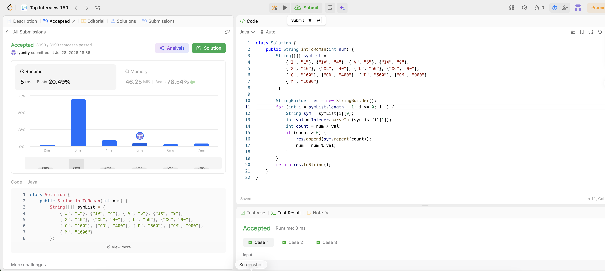

# 12. Integer to Roman

**Difficulty**: Medium<br>
**Primary Tag**: math<br>
**Secondary Tags**: hash-table, string<br>
**LeetCode Link**: https://leetcode.com/problems/integer-to-roman/

---

## Problem Summary

Given an integer, convert it to a Roman numeral by greedily subtracting the largest value symbols (including subtractive combinations like IV, IX, XL, XC, CD, CM) until the number reaches zero.

## Screenshot



---

## My Mistake(s)

<!-- What went wrong during your attempt. Be specific. -->

## Key Insight

Represent all 13 values (including the 6 subtractive combinations) in descending order, then greedily take as many of the largest symbol as fit, appending and reducing the remainder each time.

## Correct Approach

Iterate the symbol/value pairs from largest to smallest. For each pair, compute how many times the value divides into the remaining number, append the symbol that many times, and reduce the number by that amount.

```java
class Solution {
    public String intToRoman(int num) {
        String[][] symList = {
            {"I", "1"}, {"IV", "4"}, {"V", "5"}, {"IX", "9"},
            {"X", "10"}, {"XL", "40"}, {"L", "50"}, {"XC", "90"},
            {"C", "100"}, {"CD", "400"}, {"D", "500"}, {"CM", "900"},
            {"M", "1000"}
        };

        StringBuilder res = new StringBuilder();
        for (int i = symList.length - 1; i >= 0; i--) {
            String sym = symList[i][0];
            int val = Integer.parseInt(symList[i][1]);
            int count = num / val;
            if (count > 0) {
                res.append(sym.repeat(count));
                num = num % val;
            }
        }
        return res.toString();
    }
}
```

**Time Complexity**: O(1) (bounded by fixed 13 symbol pairs and num < 4000)<br>
**Space Complexity**: O(1)

---

## Practice History

| Date | Outcome | Notes |
|------|---------|-------|
| 2026-07-28 | ✅ | Accepted, 5 ms runtime (beats 20.49%), 46.25 MB memory (beats 78.54%). |
