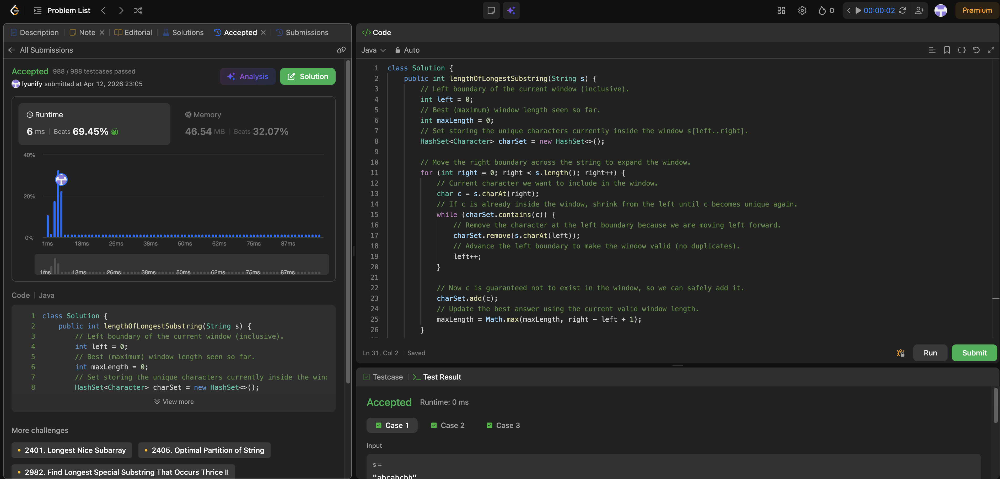

# 3. Longest Substring Without Repeating Characters

**Difficulty**: Medium<br>
**Primary Tag**: sliding-window<br>
**Secondary Tags**: hash-table, string<br>
**LeetCode Link**: https://leetcode.com/problems/longest-substring-without-repeating-characters/

---

## Problem Summary

Given a string, find the length of the longest substring that contains no repeating characters.

## Screenshot



---

## My Mistake(s)

- Forgetting that the window must be kept valid by a `while` loop (not a single `if`), otherwise duplicates can remain and the answer becomes wrong.
- Off-by-one errors in window length — must be `right - left + 1`.
- Removing the wrong character when shrinking: must remove `s.charAt(left)` *before* `left++`.
- Not handling edge cases like an empty string `""` (answer should be 0).
- Mixing the set-based approach with "last seen index" logic incorrectly — they use different invariants and must not be combined.

## Key Insight

Use a sliding window with two pointers and a `HashSet` representing the current window's unique characters. When the next character is already in the set, shrink from the left (removing `s.charAt(left)` and incrementing `left`) until the duplicate is gone; then add the new character and update `maxLength`. Each character is added and removed at most once, giving O(n) time and O(min(n, alphabet)) space.

## Correct Approach

1. Initialize `left = 0`, `maxLength = 0`, `charSet = new HashSet<>()`.
2. Iterate `right` from 0 to n−1.
3. While `charSet.contains(s.charAt(right))`: remove `s.charAt(left)`, increment `left`.
4. Add `s.charAt(right)` to `charSet`; update `maxLength = Math.max(maxLength, right - left + 1)`.
5. Return `maxLength`.

```java
class Solution {
    public int lengthOfLongestSubstring(String s) {
        int left = 0;
        int maxLength = 0;
        HashSet<Character> charSet = new HashSet<>();

        for (int right = 0; right < s.length(); right++) {
            char c = s.charAt(right);
            while (charSet.contains(c)) {
                charSet.remove(s.charAt(left));
                left++;
            }
            charSet.add(c);
            maxLength = Math.max(maxLength, right - left + 1);
        }

        return maxLength;
    }
}
```

**Time Complexity**: O(n)<br>
**Space Complexity**: O(min(n, alphabet))

---

## Practice History

| Date | Outcome | Notes |
|------|---------|-------|
| 2026-04-12 | ✅ Solved after review | Used `if` instead of `while`; off-by-one in window length; removed wrong character when shrinking |
