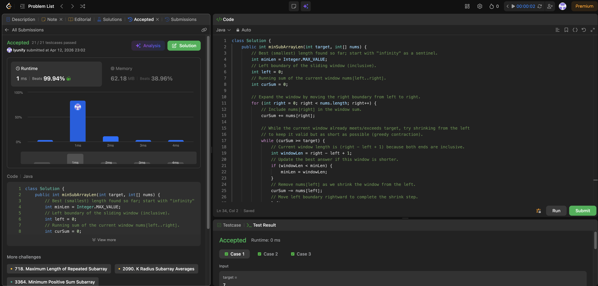

# 209. Minimum Size Subarray Sum

**Difficulty**: Medium<br>
**Primary Tag**: sliding-window<br>
**Secondary Tags**: array, two-pointers<br>
**LeetCode Link**: https://leetcode.com/problems/minimum-size-subarray-sum/

---

## Problem Summary

Given an array of positive integers and a target, find the minimal length of a contiguous subarray whose sum is ≥ target. Return 0 if no such subarray exists.

## Screenshot



---

## My Mistake(s)

- Forgetting the "positive integers" constraint and reaching for prefix-sum + binary search (or other heavier approaches) when a simple sliding window is enough.
- Using `if (curSum >= target)` instead of `while`, which misses repeated shrinking and produces a non-minimal length.
- Off-by-one in length calculation — must be `right - left + 1` (both ends are inclusive).
- Updating `minLen` *after* moving `left`, losing the correct current window length.
- Forgetting to return `0` when no valid subarray exists (i.e., `minLen` never changes from its sentinel value).

## Key Insight

Because all numbers are positive, a sliding window works: expanding right only increases the sum, and shrinking left only decreases it. That monotonic behavior lets us keep a valid window (`curSum >= target`) and greedily contract it to the shortest one for each right pointer position. This yields O(n) time and O(1) extra space.

## Correct Approach

1. Initialize `minLen = Integer.MAX_VALUE`, `left = 0`, `curSum = 0`.
2. Expand the window by iterating `right` from 0 to n−1; add `nums[right]` to `curSum`.
3. While `curSum >= target`: record `right - left + 1` as a candidate, subtract `nums[left]`, increment `left`.
4. After the loop, return `minLen == Integer.MAX_VALUE ? 0 : minLen`.

```java
class Solution {
    public int minSubArrayLen(int target, int[] nums) {
        int minLen = Integer.MAX_VALUE;
        int left = 0;
        int curSum = 0;

        for (int right = 0; right < nums.length; right++) {
            curSum += nums[right];

            while (curSum >= target) {
                int windowLen = right - left + 1;
                if (windowLen < minLen) {
                    minLen = windowLen;
                }
                curSum -= nums[left];
                left++;
            }
        }

        return minLen == Integer.MAX_VALUE ? 0 : minLen;
    }
}
```

**Time Complexity**: O(n)<br>
**Space Complexity**: O(1)

---

## Practice History

| Date | Outcome | Notes |
|------|---------|-------|
| 2026-04-12 | ✅ Solved after review | Used `if` instead of `while` for shrinking; off-by-one in window length; updated minLen after moving left |
