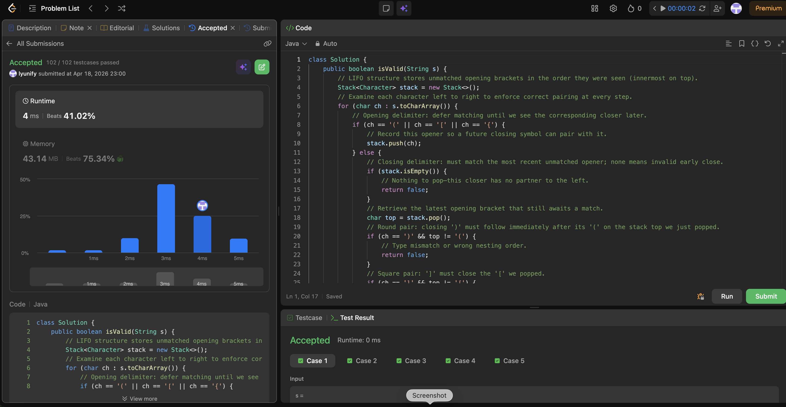

# 20. Valid Parentheses

**Difficulty**: Easy<br>
**Primary Tag**: stack<br>
**Secondary Tags**: string<br>
**LeetCode Link**: https://leetcode.com/problems/valid-parentheses/

---

## Problem Summary

Given a string containing only `(`, `)`, `{`, `}`, `[`, `]`, determine if the brackets are valid — every opener must be closed by the same type in correct nesting order.

## Screenshot



---

## My Mistake(s)

- Forgetting to check `stack.isEmpty()` before popping on a closer causes errors or wrong answers when there is no matching opener.
- Only checking counts of each bracket type (without order) fails cases like `([)]` — counts balance but nesting is wrong.
- Returning `true` after the loop without checking `stack.isEmpty()` misses unclosed openers like `((`

## Key Insight

Use a stack of opening brackets. Push on `(`, `[`, `{`; on a closing bracket, pop one opener and require it to be the matching type. The string is valid only if every close matches the most recent unmatched open (LIFO) and the stack is empty at the end — so both order and nesting are enforced in one pass.

## Correct Approach

1. Iterate over each character in `s`.
2. If it is an opener (`(`, `[`, `{`), push it.
3. If it is a closer:
   - If the stack is empty, return `false` (no matching opener).
   - Pop the top; if it doesn't match the expected opener for this closer, return `false`.
4. After the loop, return `stack.isEmpty()` — any remaining openers mean unclosed brackets.

```java
class Solution {
    public boolean isValid(String s) {
        Stack<Character> stack = new Stack<>();
        for (char ch : s.toCharArray()) {
            if (ch == '(' || ch == '[' || ch == '{') {
                stack.push(ch);
            } else {
                if (stack.isEmpty()) return false;
                char top = stack.pop();
                if (ch == ')' && top != '(') return false;
                if (ch == ']' && top != '[') return false;
                if (ch == '}' && top != '{') return false;
            }
        }
        return stack.isEmpty();
    }
}
```

**Time Complexity**: O(n)<br>
**Space Complexity**: O(n)

---

## Practice History

| Date | Outcome | Notes |
|------|---------|-------|
| 2026-04-18 | ✅ Solved after review | Stack LIFO match; must check isEmpty() before pop and after loop |
