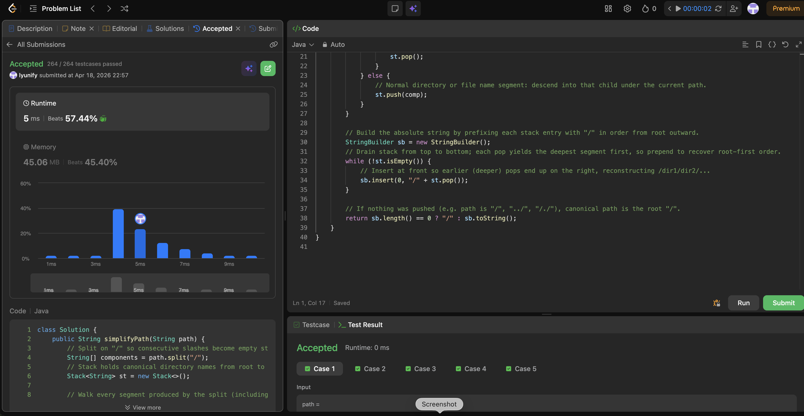

# 71. Simplify Path

**Difficulty**: Medium<br>
**Primary Tag**: stack<br>
**Secondary Tags**: string<br>
**LeetCode Link**: https://leetcode.com/problems/simplify-path/

---

## Problem Summary

Given an absolute Unix file path, return its simplified canonical form. Handle `.` (current dir), `..` (parent dir), multiple consecutive slashes, and trailing slashes.

## Screenshot



---

## My Mistake(s)

- Easy to mishandle `//`, trailing `/`, or `..` at the root. `split("/")` yields leading empty strings for paths like `/a`, so empty tokens must be skipped.
- Building the final string requires consistent ordering: popping the stack yields deepest segments first, so prepend each segment (with `sb.insert(0, ...)`) to reconstruct root-first order rather than getting a reversed path.

## Key Insight

Split on `/` to tokenize — repeated slashes become empty tokens, which are skipped. Treat the path as a stack of directory names: `.` is a no-op, `..` pops when the stack is non-empty (at virtual root it does nothing), and any other non-empty token is pushed. The canonical path is `/` plus the stack entries joined from root to leaf; an empty stack means the answer is `/`.

## Correct Approach

1. Split `path` on `"/"` to get components (includes empty strings from `//` or trailing `/`).
2. For each component:
   - Skip if empty or `"."`.
   - If `".."` and stack non-empty, pop.
   - Otherwise push the component.
3. Drain the stack by popping and prepending `"/" + segment` to a `StringBuilder`.
4. Return `"/"` if the builder is empty, otherwise the built string.

```java
class Solution {
    public String simplifyPath(String path) {
        String[] components = path.split("/");
        Stack<String> st = new Stack<>();

        for (String comp : components) {
            if (comp.isEmpty() || comp.equals(".")) {
                continue;
            } else if (comp.equals("..")) {
                if (!st.isEmpty()) st.pop();
            } else {
                st.push(comp);
            }
        }

        StringBuilder sb = new StringBuilder();
        while (!st.isEmpty()) {
            sb.insert(0, "/" + st.pop());
        }
        return sb.length() == 0 ? "/" : sb.toString();
    }
}
```

**Time Complexity**: O(n)<br>
**Space Complexity**: O(n)

---

## Practice History

| Date | Outcome | Notes |
|------|---------|-------|
| 2026-04-18 | ✅ Solved after review | Stack + split on "/"; skip empty/"." tokens; prepend when draining stack to preserve order |
