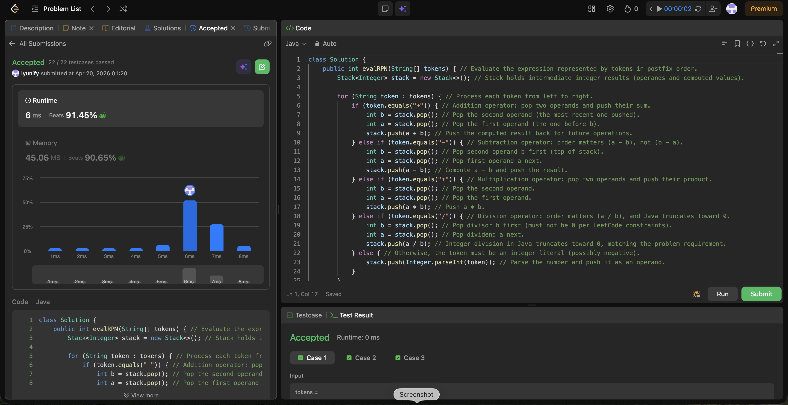

# 150. Evaluate Reverse Polish Notation

**Difficulty**: Medium<br>
**Primary Tag**: stack<br>
**Secondary Tags**: array, math<br>
**LeetCode Link**: https://leetcode.com/problems/evaluate-reverse-polish-notation/

---

## Problem Summary

Evaluate the value of an arithmetic expression in Reverse Polish Notation (postfix). Valid operators are `+`, `-`, `*`, and `/`. Each operand may be an integer or another expression. Division truncates toward zero.

## Screenshot



---

## My Mistake(s)

- Wrote `stack.push(stack.pop() - stack.pop())`, which silently reverses operands and gives wrong answers for subtraction and division.
- Forgot that tokens can be negative numbers (e.g. `"-11"`), so operator detection must use exact string match (`equals("+")`, etc.), not a first-character check.
- Assumed the stack could end with more than one value; the correct invariant is that after processing all tokens exactly one value remains as the final result.

## Key Insight

A stack is the natural fit for RPN: numbers push, operators pop two operands, compute, then push the result back — making the whole evaluation O(n). Pop order matters for `-` and `/`: pop `b` first (top), then pop `a`, and compute `a - b` / `a / b`. Java integer division already truncates toward 0, matching LeetCode's requirement.

## Correct Approach

Iterate through each token. If it is an operator, pop `b` then `a` and push `a OP b`. Otherwise parse the token as an integer and push it. Return `stack.pop()` at the end.

```java
public int evalRPN(String[] tokens) {
    Stack<Integer> stack = new Stack<>();

    for (String token : tokens) {
        if (token.equals("+")) {
            int b = stack.pop();
            int a = stack.pop();
            stack.push(a + b);
        } else if (token.equals("-")) {
            int b = stack.pop();
            int a = stack.pop();
            stack.push(a - b);
        } else if (token.equals("*")) {
            int b = stack.pop();
            int a = stack.pop();
            stack.push(a * b);
        } else if (token.equals("/")) {
            int b = stack.pop();
            int a = stack.pop();
            stack.push(a / b);
        } else {
            stack.push(Integer.parseInt(token));
        }
    }

    return stack.pop();
}
```

**Time Complexity**: O(n)<br>
**Space Complexity**: O(n)

---

## Practice History

| Date | Outcome | Notes |
|------|---------|-------|
| 2026-04-20 | Solved after review | Reversed operand order on pop; used char check instead of equals() for negative-number tokens |
