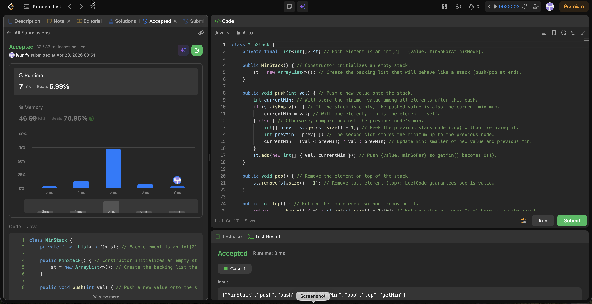

# 155. Min Stack

**Difficulty**: Medium<br>
**Primary Tag**: stack<br>
**Secondary Tags**: design<br>
**LeetCode Link**: https://leetcode.com/problems/min-stack/

---

## Problem Summary

Design a stack that supports push, pop, top, and retrieving the minimum element in constant time.

## Screenshot



---

## My Mistake(s)

- Initially forgot that storing only values makes `getMin()` O(n) unless additional min information is maintained alongside each element.
- Mixed up which index stores what (value vs min), causing wrong answers when returning `[0]`/`[1]` incorrectly.
- Didn't handle the empty-stack boundary carefully in the first draft — the first push must set `minSoFar = val` directly.

## Key Insight

Storing a pair `{value, minSoFar}` at each stack level turns `getMin()` into O(1) with no extra auxiliary stack needed. The only state to carry forward is the previous `minSoFar`; the new minimum is simply `min(val, prevMin)`. Keeping the "top" at the end of an `ArrayList` makes push/pop straightforward and efficient.

## Correct Approach

Each node in the backing list stores `int[]{value, minSoFar}`. On push, peek the previous top's min (or use `val` itself if the stack is empty) to compute the new running minimum, then append `{val, currentMin}`. Pop removes the last element. `top()` returns `list[size-1][0]`; `getMin()` returns `list[size-1][1]`.

```java
class MinStack {
    private final List<int[]> st;

    public MinStack() {
        st = new ArrayList<>();
    }

    public void push(int val) {
        int currentMin;
        if (st.isEmpty()) {
            currentMin = val;
        } else {
            int[] prev = st.get(st.size() - 1);
            int prevMin = prev[1];
            currentMin = (val < prevMin) ? val : prevMin;
        }
        st.add(new int[]{ val, currentMin });
    }

    public void pop() {
        st.remove(st.size() - 1);
    }

    public int top() {
        return st.isEmpty() ? -1 : st.get(st.size() - 1)[0];
    }

    public int getMin() {
        return st.get(st.size() - 1)[1];
    }
}
```

**Time Complexity**: O(1) for all operations<br>
**Space Complexity**: O(n)

---

## Practice History

| Date | Outcome | Notes |
|------|---------|-------|
| 2026-04-20 | Solved after review | Forgot to co-locate min with each node; confused index order for value vs min |
