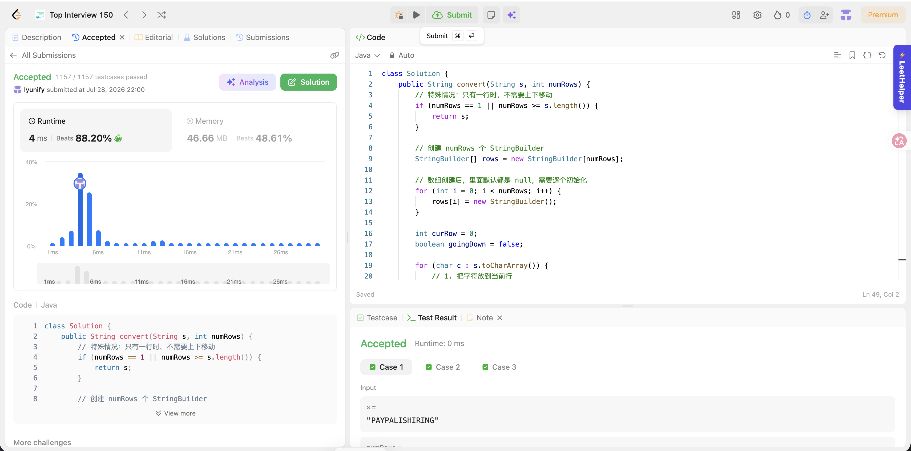

# 6. ZigZag Conversion

**Difficulty**: Medium<br>
**Primary Tag**: string<br>
**Secondary Tags**: <!-- e.g. hash-table, two-pointers --><br>
**LeetCode Link**: https://leetcode.com/problems/zigzag-conversion/

---

## Problem Summary

Given a string `s` and a number of rows `numRows`, write the characters in a zigzag pattern across `numRows` rows (down then diagonally up, repeating), then read the result row by row.

## Screenshot



---

## My Mistake(s)

<!-- What went wrong during your attempt. Be specific. -->

## Key Insight

- Simulate the zigzag directly instead of computing indices with a formula: track a `curRow` pointer and a `goingDown` direction flag.
- Each character is appended to a `StringBuilder` for its current row; `curRow` moves down until it hits the last row, then moves up until it hits the first row, flipping `goingDown` at each boundary.
- The final answer is the concatenation of all row buffers in order.
- Handle `numRows == 1` (or `numRows >= s.length()`) as a special case—no zigzagging occurs, so just return `s` unchanged.

## Correct Approach

1. If `numRows == 1` or `numRows >= s.length()`, return `s` directly (no zigzag possible).
2. Create `numRows` `StringBuilder`s, one per row.
3. Walk through `s` character by character, appending each char to `rows[curRow]`.
4. Move `curRow` down while `goingDown` is true; when it reaches the last row, flip to going up; when it reaches the first row, flip to going down.
5. Concatenate all row buffers and return the result.

```java
class Solution {
    public String convert(String s, int numRows) {
        // Edge case: single row, no zigzag needed
        if (numRows == 1 || numRows >= s.length()) {
            return s;
        }

        // Create numRows StringBuilders
        StringBuilder[] rows = new StringBuilder[numRows];

        // Arrays of objects default to null, so initialize each one
        for (int i = 0; i < numRows; i++) {
            rows[i] = new StringBuilder();
        }

        int curRow = 0;
        boolean goingDown = false;

        for (char c : s.toCharArray()) {
            // Place the character on the current row
            rows[curRow].append(c);

            // Flip direction at the top or bottom row
            if (curRow == 0 || curRow == numRows - 1) {
                goingDown = !goingDown;
            }
            curRow += goingDown ? 1 : -1;
        }

        StringBuilder res = new StringBuilder();
        for (StringBuilder row : rows) {
            res.append(row);
        }
        return res.toString();
    }
}
```

**Time Complexity**: O(n)<br>
**Space Complexity**: O(n)

---

## Practice History

| Date | Outcome | Notes |
|------|---------|-------|
| 2026-07-28 | ✅ | Accepted, 4 ms runtime (beats 88.20%), 46.66 MB memory (beats 48.61%). |
