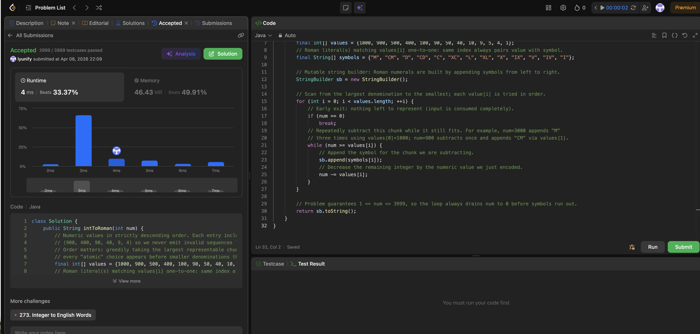

# 12. Integer to Roman

**Difficulty**: Medium<br>
**Primary Tag**: string<br>
**Secondary Tags**: math, greedy<br>
**LeetCode Link**: https://leetcode.com/problems/integer-to-roman/

---

## Problem Summary

Given an integer in the range 1–3999, convert it to a Roman numeral string using both additive and subtractive forms (e.g., 4 → IV, 9 → IX, 1994 → MCMXCIV).

## Screenshot



---

## My Mistake(s)

- **Wrong or incomplete value/symbol tables**: Forgetting to include the six subtractive forms (900, 400, 90, 40, 9, 4) and trying to patch logic with special cases afterward. Also misordering entries — placing a smaller value before a larger subtractive combination breaks the greedy strategy.
- **Confusing intToRoman with romanToInt**: In `intToRoman`, you repeatedly subtract from `num` and append symbols. In `romanToInt`, you compare adjacent characters. Mixing the two ideas leads to wrong append conditions or unnecessary lookahead.
- **String concatenation in a loop**: Writing `s = s + "M"` inside a loop gives the correct answer but can cause O(n²) behavior in total output construction. Use `StringBuilder` instead.
- **Not breaking when num reaches 0**: Usually harmless for correctness, but if `num` is not decreasing properly the loop could get stuck. The key safety invariant is that `num` must strictly decrease inside the inner loop.
- **Typos in symbols[] relative to values[]**: If the two arrays are misaligned (e.g., "CD" and "D" accidentally swapped), every number involving those ranges converts incorrectly. Subtle because the code structure still looks fine. Verify with known examples: `1994 → MCMXCIV`, `58 → LVIII`.
- **Edge cases**: LeetCode guarantees input in 1–3999, so 0, negatives, and ≥ 4000 don't need handling here, but a general-purpose API would require guards.

## Key Insight

**Greedy decomposition on a fixed, ordered symbol table.** At each step, subtract the largest Roman value that still fits in `num` and append its symbol, repeating until `num` reaches 0. This greedy choice always produces the canonical Roman representation for 1–3999.

**Subtractive forms must be explicit rows in the table.** If the table only lists the seven basic symbols, the greedy algorithm may produce too many repeated symbols instead of a legal subtractive pair. By including CM (900), CD (400), XC (90), XL (40), IX (9), and IV (4) as their own entries, every greedy pick is a valid Roman building block — no special-casing needed.

**Descending order is the correctness invariant.** The values array must be strictly decreasing so the algorithm always tries the largest denomination first. The inner `while` loop handles repeated use of the same symbol (e.g., M three times for 3000). No backtracking is ever required.

## Correct Approach

1. Define parallel arrays in strictly decreasing order:
   `values = {1000, 900, 500, 400, 100, 90, 50, 40, 10, 9, 5, 4, 1}`
   `symbols = {"M", "CM", "D", "CD", "C", "XC", "L", "XL", "X", "IX", "V", "IV", "I"}`
2. For each index `i`, while `num >= values[i]`: append `symbols[i]`, subtract `values[i]`.
3. Return the built string.

```java
class Solution {
    public String intToRoman(int num) {
        final int[] values    = {1000, 900, 500, 400, 100, 90, 50, 40, 10, 9, 5, 4, 1};
        final String[] symbols = {"M", "CM", "D", "CD", "C", "XC", "L", "XL", "X", "IX", "V", "IV", "I"};

        StringBuilder sb = new StringBuilder();

        for (int i = 0; i < values.length; i++) {
            if (num == 0) break;
            while (num >= values[i]) {
                sb.append(symbols[i]);
                num -= values[i];
            }
        }

        return sb.toString();
    }
}
```

**Time Complexity**: O(1) — the table has constant size and input is bounded to 1–3999<br>
**Space Complexity**: O(1) extra (plus O(output length) for the result)

---

## Practice History

| Date | Outcome | Notes |
|------|---------|-------|
| 2026-04-08 | ✅ | Solved after review — key insight: include all 13 entries (with subtractive forms) in descending order; greedy inner while loop handles repeats |
