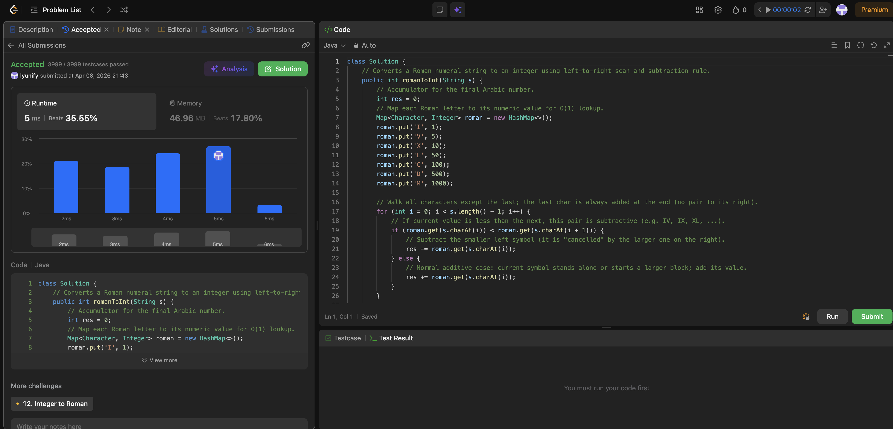

# 13. Roman to Integer

**Difficulty**: Easy<br>
**Primary Tag**: string<br>
**Secondary Tags**: hash-table, math<br>
**LeetCode Link**: https://leetcode.com/problems/roman-to-integer/

---

## Problem Summary

Given a Roman numeral string, convert it to an integer. Roman numerals use additive notation except for six subtractive forms (IV, IX, XL, XC, CD, CM) where a smaller symbol before a larger one means subtraction.

## Screenshot



---

## My Mistake(s)

- **Off-by-one / double counting**: Using `for (i = 0; i < s.length(); i++)` and then still adding the last character again afterward, or stopping early and forgetting to add it at all. The last character must be added exactly once.
- **Wrong operand in subtraction**: For IV, you subtract I (1), not V (5). The smaller left symbol is the one subtracted; the right symbol is handled normally when its own position is processed.
- **Misunderstanding the rule**: Not every small-before-large combination is valid — only the six standard subtractive forms are legal. LeetCode guarantees valid input, but misunderstanding leads to fragile code.
- **Naive summation**: Simply adding every symbol value without lookahead gives IV = 1 + 5 = 6 instead of 4. Some form of lookahead is necessary.
- **Lookup table errors**: Confusing L (50) with C (100) or D (500) with M (1000) produces code that looks reasonable but fails many test cases — especially deceptive because a few simple manual examples may still pass.
- **Empty string**: Not relevant for LeetCode (input is guaranteed valid and nonempty), but in production code it is safer to guard against `s.length() == 0` before accessing the last character.

## Key Insight

**Subtractive pairs are local decisions.** When scanning left to right, compare `value(s[i])` with `value(s[i+1])`. If `s[i] < s[i+1]`, subtract `s[i]`; otherwise add it. This single rule covers all six subtractive forms without special-casing each one.

**The last character is special.** Since the rule depends on a right neighbor, the loop runs only from index 0 to `length - 2`, and the last character's value is added unconditionally after the loop. This also handles the single-character edge case: the loop doesn't run, and the result is just that one symbol's value.

Use a `HashMap` for the seven-symbol lookup table — it keeps the code readable and provides O(1) access. A `switch` on `char` works too but offers no meaningful benefit here.

## Correct Approach

1. Build a map: `I→1, V→5, X→10, L→50, C→100, D→500, M→1000`.
2. Loop `i` from 0 to `s.length() - 2`. If `roman[s[i]] < roman[s[i+1]]`, subtract `roman[s[i]]`; else add it.
3. After the loop, add the value of the last character.
4. Return the accumulated result.

```java
class Solution {
    public int romanToInt(String s) {
        int res = 0;
        Map<Character, Integer> roman = new HashMap<>();
        roman.put('I', 1);
        roman.put('V', 5);
        roman.put('X', 10);
        roman.put('L', 50);
        roman.put('C', 100);
        roman.put('D', 500);
        roman.put('M', 1000);

        for (int i = 0; i < s.length() - 1; i++) {
            if (roman.get(s.charAt(i)) < roman.get(s.charAt(i + 1))) {
                res -= roman.get(s.charAt(i));
            } else {
                res += roman.get(s.charAt(i));
            }
        }

        // Always add the last character (no right neighbor to compare against)
        res += roman.get(s.charAt(s.length() - 1));
        return res;
    }
}
```

**Time Complexity**: O(n)<br>
**Space Complexity**: O(1) — lookup table has constant size (7 entries)

---

## Practice History

| Date | Outcome | Notes |
|------|---------|-------|
| 2026-04-08 | ✅ | Solved after review — key insight: subtract s[i] when it is less than s[i+1]; loop to length-2 then add last char |
