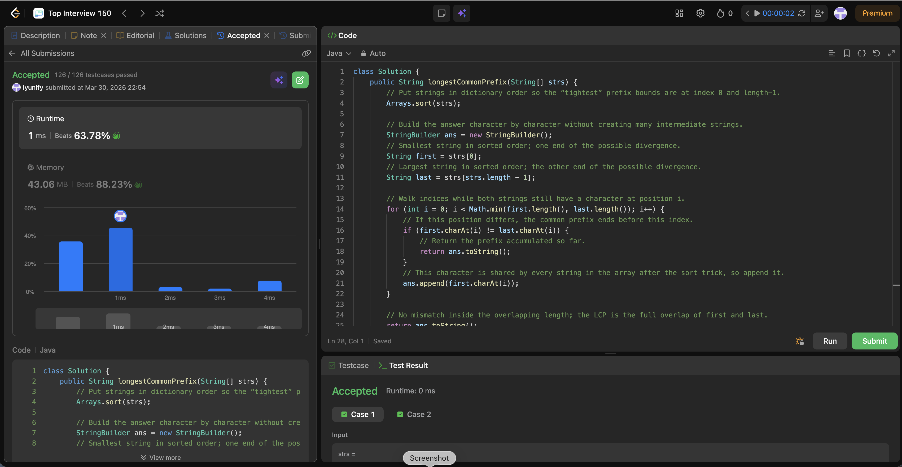

# 14. Longest Common Prefix

**Difficulty**: Easy<br>
**Primary Tag**: string<br>
**Secondary Tags**: array<br>
**LeetCode Link**: https://leetcode.com/problems/longest-common-prefix/

---

## Problem Summary

Given an array of strings, find the longest common prefix shared among all of them. Return an empty string if there is none.

## Screenshot



---

## My Mistake(s)

- **Wrong mental model.** Defaulted to comparing every string against a fixed "prefix" or scanning column-by-column without noticing that after sorting, only the first and last strings matter.
- **Mutating the input.** `Arrays.sort(strs)` sorts in place—callers that rely on the original order are silently broken. Sort a copy if input order must be preserved.
- **Incomplete complexity analysis.** Sorting is O(n log n) string comparisons, each costing up to O(L); the final scan is O(min(|first|, |last|)). Easy to quote only one part and get the full picture wrong.
- **Missing edge cases.** All-empty-string inputs or an empty array aren't in LeetCode's constraints but are worth handling for off-site correctness.

## Key Insight

- **Lexicographic sort squeezes divergence to the ends.** After sorting, the LCP of the entire set equals the LCP of just `strs[0]` (minimum) and `strs[strs.length - 1]` (maximum), because every other string lies between them in dictionary order—they can only agree where the extremes agree.
- **Implementation pattern:** `Arrays.sort(strs)` → take `strs[0]` and `strs[strs.length - 1]` → walk indices until characters differ → return the built prefix.
- **Trade-off vs. no-sort approach.** The sort-based approach pays O(n log n · L) upfront for a final compare that only touches two strings. The no-sort alternative (use first string as candidate and shrink by scanning all strings) is O(n · L) with better constants and preserves input order—often the preferred interview answer.

## Correct Approach

1. Sort the array lexicographically (`Arrays.sort(strs)`).
2. Compare only `first = strs[0]` and `last = strs[strs.length - 1]`.
3. Walk indices `0 .. min(|first|, |last|) - 1`; stop and return accumulated prefix when characters differ.
4. If the loop completes without mismatch, return the full overlap (the shorter of the two strings).

```java
class Solution {
    public String longestCommonPrefix(String[] strs) {
        Arrays.sort(strs);
        StringBuilder ans = new StringBuilder();
        String first = strs[0];
        String last = strs[strs.length - 1];

        for (int i = 0; i < Math.min(first.length(), last.length()); i++) {
            if (first.charAt(i) != last.charAt(i)) {
                return ans.toString();
            }
            ans.append(first.charAt(i));
        }
        return ans.toString();
    }
}
```

**Time Complexity**: O(n log n · L) for sort, O(L) for the final scan<br>
**Space Complexity**: O(1) extra (ignoring sort stack and output)

---

## Practice History

| Date | Outcome | Notes |
|------|---------|-------|
| 2026-03-30 | Solved after review | Missed the sort-then-compare-extremes insight; incomplete complexity analysis |
