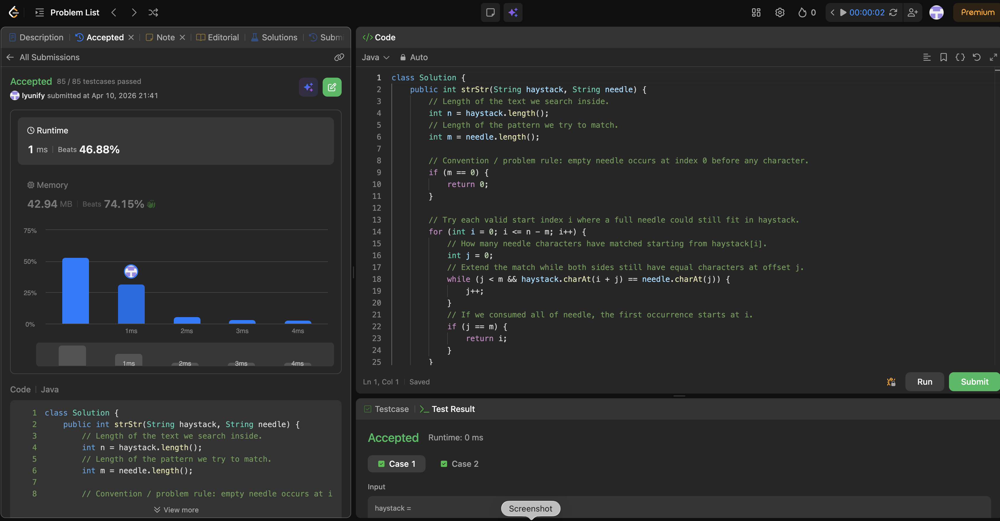

# 28. Find the Index of the First Occurrence in a String

**Difficulty**: Easy<br>
**Primary Tag**: string<br>
**Secondary Tags**: two-pointers<br>
**LeetCode Link**: https://leetcode.com/problems/find-the-index-of-the-first-occurrence-in-a-string/

---

## Problem Summary

Given two strings `haystack` and `needle`, return the index of the first occurrence of `needle` in `haystack`, or -1 if `needle` is not found. An empty needle returns 0.

## Screenshot



---

## My Mistake(s)

- Forgot the empty-needle rule: many stubs return -1 by habit, but here an empty needle must return 0.
- Off-by-one in the outer loop: the last valid start index is `n - m`, not `n - 1` or `n - m - 1`; otherwise we read past the end or skip valid starts.
- Mixing up `i` and `i + j`: the inner loop must compare `haystack.charAt(i + j)` with `needle.charAt(j)`, not `haystack.charAt(i)` every time.
- Stopping early: after a partial match fails, the correct move is to advance `i` by one and reset `j`, not skip ahead without a proper algorithm (e.g. KMP) — otherwise you can miss the true first occurrence.

## Key Insight

- First occurrence = scan starts from the left: try each start `i` from 0 upward; the first full match is the answer, so you can return immediately.
- Inner while = verify one alignment: for fixed `i`, extend `j` while characters match; `j == m` means success at `i`.
- Complexity: worst time O(n × m) for length n haystack and m needle; O(1) extra space. For repeated queries or very long needles, KMP or built-ins (`indexOf`) are the standard upgrades, but the double loop is the clearest template to internalize first.

## Correct Approach

1. Handle the empty-needle edge case: if `m == 0`, return 0.
2. Loop `i` from 0 to `n - m` (inclusive) — these are all valid start positions where a full needle could still fit.
3. For each `i`, use an inner pointer `j` starting at 0; advance while `haystack.charAt(i + j) == needle.charAt(j)`.
4. If `j == m`, every character matched — return `i`.
5. If the loop ends without a full match, return -1.

```java
class Solution {
    public int strStr(String haystack, String needle) {
        int n = haystack.length();
        int m = needle.length();

        if (m == 0) {
            return 0;
        }

        for (int i = 0; i <= n - m; i++) {
            int j = 0;
            while (j < m && haystack.charAt(i + j) == needle.charAt(j)) {
                j++;
            }
            if (j == m) {
                return i;
            }
        }

        return -1;
    }
}
```

**Time Complexity**: O(n × m)<br>
**Space Complexity**: O(1)

---

## Practice History

| Date | Outcome | Notes |
|------|---------|-------|
| 2026-03-31 | ✅ | Accepted; mistakes on empty-needle rule, off-by-one bound, and i vs i+j indexing |
| 2026-04-10 | ✅ | Solved after review; repeated mistakes: empty-needle edge case, i <= n-m bound, bounds on inner loop, verifying j == m, and missing small edge-case tests |
