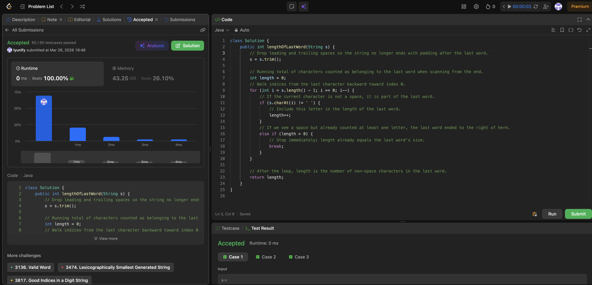

# 58. Length of Last Word

**Difficulty**: Easy<br>
**Primary Tag**: string<br>
**Secondary Tags**: <!-- none --><br>
**LeetCode Link**: https://leetcode.com/problems/length-of-last-word/

---

## Problem Summary

Given a string `s` consisting of words and spaces, return the length of the **last** word in the string. A word is a maximal substring consisting of non-space characters only.

## Screenshot



---

## My Mistake(s)

- **No concrete plan.** I knew the answer was "length of the last word" but did not translate that into concrete steps (where does the last word start and end?).
- **Confusion about what "last word" means with spaces.** I conflated two separate ideas: (1) ignore trailing spaces after the final word, and (2) the last word may be preceded by many spaces. Treating the string as one long token led nowhere.
- **Wrong scan direction.** I tried scanning left-to-right without a clear rule for when a word ends; the last word is far easier to characterize from the right end of the string.
- **split / regex rabbit hole.** I considered splitting on spaces but worried about empty strings from consecutive spaces, off-by-one on the array index, and extra allocations—without realizing a simple one-pass from the right avoids all of that.
- **Forgot edge cases tied to spaces.** E.g., string padded on both sides (`" word "`), only spaces between words, very long runs of spaces. Did not test these mentally before coding.
- **Off-by-one and empty-string fears.** Unsure whether to start at `length()` or `length() - 1`, and whether trimming could yield empty (constraints guarantee at least one word, but I did not use that to simplify reasoning).

## Key Insight

- **Define the last word by the string's shape, not by English.** After trimming (or equivalently: skip trailing spaces, then count backward), the last word is the maximal contiguous block of non-space characters at the suffix of the processed string.
- **Two equivalent O(n) / O(1) strategies:**
  1. `trim()` first, then walk right-to-left incrementing a counter on letters and stopping at the first space.
  2. No trim—move an index left while skipping spaces, then count letters until hitting a space or the start.
- **Why right-to-left wins:** the "last" word is anchored at the end; left-to-right forces you to remember "current word" across the whole string, while right-to-left only needs one running count.
- **Consecutive spaces are just multiple delimiters**—the algorithm must never depend on "exactly one space between words."

## Correct Approach

1. Trim the string (removes leading/trailing spaces).
2. Walk from the last character backward.
3. Increment a counter for each non-space character encountered.
4. Stop (break) the moment you hit a space **after** having already counted at least one letter.
5. Return the counter.

```java
class Solution {
    public int lengthOfLastWord(String s) {
        s = s.trim();
        int length = 0;
        for (int i = s.length() - 1; i >= 0; i--) {
            if (s.charAt(i) != ' ') {
                length++;
            } else if (length > 0) {
                break;
            }
        }
        return length;
    }
}
```

**Time Complexity**: O(n)<br>
**Space Complexity**: O(1)

---

## Practice History

| Date | Outcome | Notes |
|------|---------|-------|
| 2026-03-26 | Solved after review | No plan going in; confused by trailing/multiple spaces; key fix: scan right-to-left after trim |
