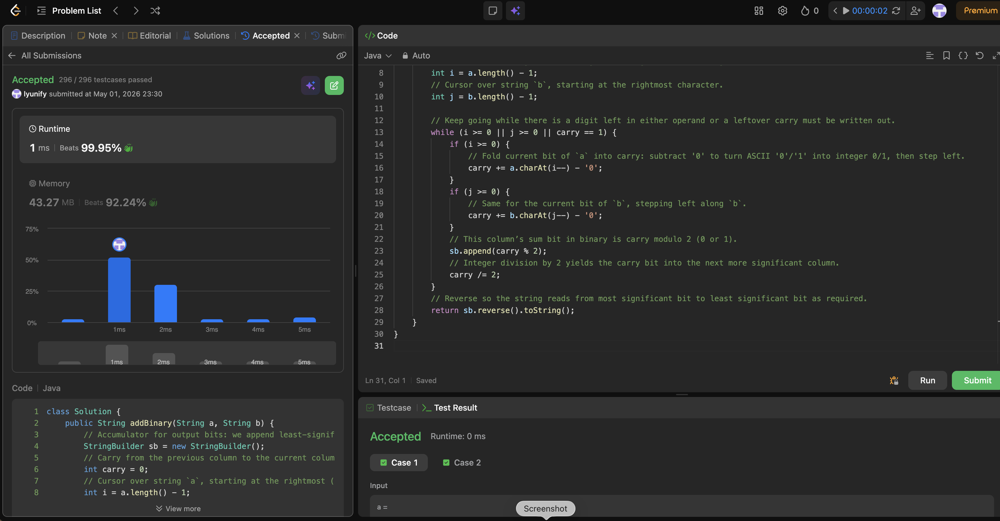

# 67. Add Binary

**Difficulty**: Easy<br>
**Primary Tag**: string<br>
**Secondary Tags**: math, simulation<br>
**LeetCode Link**: https://leetcode.com/problems/add-binary/

---

## Problem Summary

Given two binary strings `a` and `b`, return their sum as a binary string.

## Screenshot



---

## My Mistake(s)

- Built the result left-to-right without reversing, so the string had bits in the wrong order.
- Parsed whole substrings to `int`, which overflows on long binary strings — must add digit by digit.
- Forgot the final carry when both pointers are exhausted, unless the loop condition explicitly allows a last iteration for `carry == 1`.
- Used `carry > 0` in the while condition but then missed emitting a trailing zero column in some edge cases — pair the condition carefully with how carry is updated.
- Confused `carry == 1` with "any nonzero carry"; after each step carry should only be 0 or 1 for the next iteration, but the sum before `%` can be 2 or 3 — mixing that up led to wrong if-branches.
- Off-by-one on string indices when moving `i--` and `j--` before or after reading the character.

## Key Insight

Binary addition is the same as base-10 "column by column" with carry, but each digit is only 0 or 1. Process from the right end of both strings: add bits into an integer `carry` (which can temporarily be 0–3 when two ones and an incoming carry meet), append `carry % 2` for the result bit, then set `carry /= 2` for the next column. Continue while either index is valid or you still have a carry to flush. Because bits are appended from LSB to MSB, **reverse the builder before returning**. Converting characters with `c - '0'` avoids `Integer.parseInt` on substrings and keeps the loop O(n). Time O(max(m, n)), space O(max(m, n)) for the output.

## Correct Approach

1. Initialize `StringBuilder sb`, `int carry = 0`, and pointers `i = a.length()-1`, `j = b.length()-1`.
2. Loop `while (i >= 0 || j >= 0 || carry == 1)`.
3. Inside the loop: if `i >= 0`, do `carry += a.charAt(i--) - '0'`; same for `j`.
4. Append `carry % 2` to `sb`, then set `carry /= 2`.
5. Return `sb.reverse().toString()`.

```java
class Solution {
    public String addBinary(String a, String b) {
        StringBuilder sb = new StringBuilder();
        int carry = 0;
        int i = a.length() - 1;
        int j = b.length() - 1;

        while (i >= 0 || j >= 0 || carry == 1) {
            if (i >= 0) {
                carry += a.charAt(i--) - '0';
            }
            if (j >= 0) {
                carry += b.charAt(j--) - '0';
            }
            sb.append(carry % 2); // result bit for this column
            carry /= 2;           // carry into next column (0 or 1)
        }

        return sb.reverse().toString();
    }
}
```

**Time Complexity**: O(max(m, n))<br>
**Space Complexity**: O(max(m, n))

---

## Practice History

| Date | Outcome | Notes |
|------|---------|-------|
| 2026-05-01 | ✅ Solved after review | Forgot to reverse the StringBuilder; must use `carry == 1` in loop condition to flush final carry |
