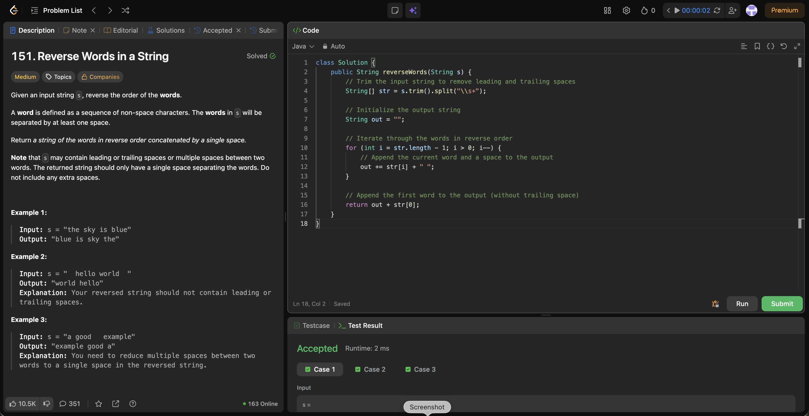

# 151. Reverse Words in a String

**Difficulty**: Medium<br>
**Primary Tag**: string<br>
**Secondary Tags**: two-pointers<br>
**LeetCode Link**: https://leetcode.com/problems/reverse-words-in-a-string/

---

## Problem Summary

Given an input string `s`, reverse the order of the words. Words are separated by spaces; the output must have single spaces between words with no leading or trailing spaces.

## Screenshot



---

## My Mistake(s)

- **Used `split(" ")` instead of `split("\\s+")`**, producing empty tokens when multiple consecutive spaces were present, which introduced extra spaces in the output.
- **Forgot to trim first**, so leading/trailing spaces survived into the reversed result.
- **Reversed characters instead of words** by thinking about "reverse string" too literally—needed to reverse the list of word tokens, not individual characters.
- **Appended a space after every word** without special-casing the last (first in reverse order), leaving a trailing space in the output.
- **Skipped key test cases** like `" hello world "` and `"a good   example"` early, so spacing bugs weren't caught until late.

## Key Insight

- **Treat words as maximal non-space blocks.** Extra spaces are irrelevant once you split on `\s+` (or do a pointer scan that skips runs of spaces).
- **Trim + split + reverse + join** is the cleanest approach: `s.trim().split("\\s+")` eliminates empty tokens; iterate the resulting array backward and join with `" "`.
- **Two-pointer backward scan** avoids allocating a word array: skip spaces from the right, mark end of word `i`, scan left to find start `j+1`, append `s.substring(j+1, i+1)`, repeat—O(n) time and O(output) space.
- **Output contract:** single spaces only between words, no leading/trailing spaces.

## Correct Approach

1. `trim()` the string, then `split("\\s+")` to get clean word tokens.
2. Iterate from the last token to the first, appending each word followed by a space.
3. Append the first token (index 0) without a trailing space, then return.

```java
class Solution {
    public String reverseWords(String s) {
        String[] str = s.trim().split("\\s+");
        String out = "";
        for (int i = str.length - 1; i > 0; i--) {
            out += str[i] + " ";
        }
        return out + str[0];
    }
}
```

**Time Complexity**: O(n)<br>
**Space Complexity**: O(n)

---

## Practice History

| Date | Outcome | Notes |
|------|---------|-------|
| 2026-04-10 | Solved after review | split(" ") empty-token bug; forgot trim(); reversed chars not words; trailing space from appending after every word; missed " hello world " and "a good   example" test cases |
