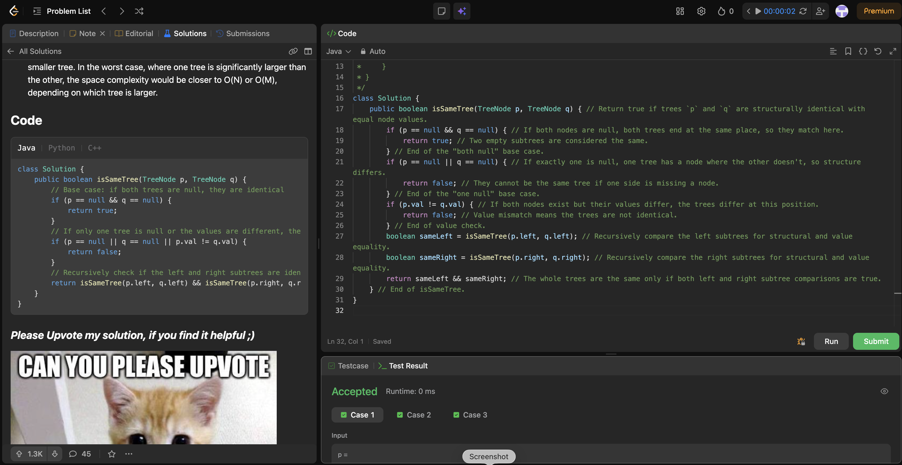

# 100. Same Tree

**Difficulty**: Easy<br>
**Primary Tag**: tree<br>
**Secondary Tags**: depth-first-search, recursion<br>
**LeetCode Link**: https://leetcode.com/problems/same-tree/

---

## Problem Summary

Given the roots of two binary trees `p` and `q`, return `true` if they are structurally identical with the same node values, and `false` otherwise.

## Screenshot



---

## My Mistake(s)

- Only comparing node values but not structure (e.g., forgetting the "one null" case), which can incorrectly return `true`.
- Putting `p.val != q.val` before confirming `p` and `q` are non-null, causing null pointer errors.
- Using `||` instead of `&&` when combining subtree results, which would accept trees where only one side matches.

## Key Insight

- You must compare both **structure and values**: two nodes match only if their values match *and* their left/right subtrees also match.
- The clean recursion has three checks in order: (1) both null → `true`, (2) one null → `false`, (3) value mismatch → `false`, else recurse both subtrees with `&&`.
- Each pair of nodes is visited once → O(n) time; recursion stack is O(h).

## Correct Approach

1. If both `p` and `q` are `null` → return `true` (same empty structure).
2. If exactly one is `null` → return `false` (structure differs).
3. If `p.val != q.val` → return `false` (value differs).
4. Recurse: return `isSameTree(p.left, q.left) && isSameTree(p.right, q.right)`.

```java
class Solution {
    public boolean isSameTree(TreeNode p, TreeNode q) {
        if (p == null && q == null) {
            return true;
        }
        if (p == null || q == null) {
            return false;
        }
        if (p.val != q.val) {
            return false;
        }
        boolean sameLeft = isSameTree(p.left, q.left);
        boolean sameRight = isSameTree(p.right, q.right);
        return sameLeft && sameRight;
    }
}
```

**Time Complexity**: O(n) — each node pair visited once<br>
**Space Complexity**: O(h) — recursion stack, O(n) worst case for skewed trees

---

## Practice History

| Date | Outcome | Notes |
|------|---------|-------|
| 2026-04-26 | ✅ | Solved after review — forgot "one null" case; used \|\| instead of && for subtree results |
