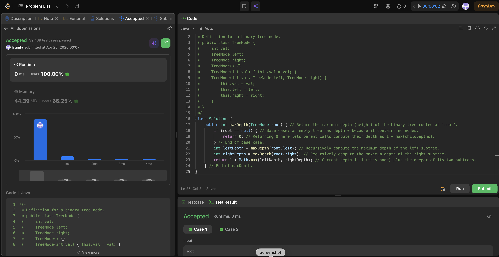

# 104. Maximum Depth of Binary Tree

**Difficulty**: Easy<br>
**Primary Tag**: tree<br>
**Secondary Tags**: depth-first-search, recursion<br>
**LeetCode Link**: https://leetcode.com/problems/maximum-depth-of-binary-tree/

---

## Problem Summary

Given the root of a binary tree, return its maximum depth — the number of nodes along the longest path from the root down to the farthest leaf.

## Screenshot



---

## My Mistake(s)

- Returning `1` for `null` (or mixing "number of nodes" vs "number of edges" definitions), which shifts the answer by 1.
- Forgetting the `+1` for the current node, which undercounts all depths.
- Assuming recursion stack space is always O(log n); in a skewed tree it becomes O(n).

## Key Insight

- The depth of a node is `1 + max(leftDepth, rightDepth)`; the extra `1` accounts for the current node itself.
- The base case is crucial: `null` means an empty tree whose depth is `0`, so parent calls compute `1 + max(0, childDepth)` correctly.
- DFS recursion visits each node once → O(n) time; stack space is O(h) where h is tree height (O(n) worst case for skewed trees).

## Correct Approach

1. Base case: if `root == null`, return `0`.
2. Recursively compute `leftDepth = maxDepth(root.left)` and `rightDepth = maxDepth(root.right)`.
3. Return `1 + Math.max(leftDepth, rightDepth)`.

```java
class Solution {
    public int maxDepth(TreeNode root) {
        if (root == null) {
            return 0;
        }
        int leftDepth = maxDepth(root.left);
        int rightDepth = maxDepth(root.right);
        return 1 + Math.max(leftDepth, rightDepth);
    }
}
```

**Time Complexity**: O(n) — every node visited once<br>
**Space Complexity**: O(h) — recursion stack, O(n) worst case for skewed tree

---

## Practice History

| Date | Outcome | Notes |
|------|---------|-------|
| 2026-04-26 | ✅ | Solved after review — confused null base case return value; forgot +1 for current node |
