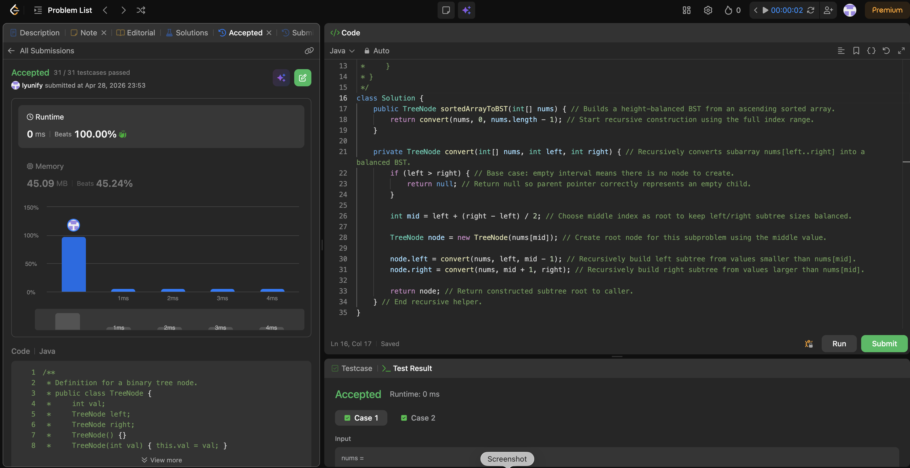

# 0108. Convert Sorted Array to Binary Search Tree

**Difficulty**: Easy<br>
**Primary Tag**: tree<br>
**Secondary Tags**: binary-search, array<br>
**LeetCode Link**: https://leetcode.com/problems/convert-sorted-array-to-binary-search-tree/

---

## Problem Summary

Given an integer array `nums` sorted in ascending order, convert it to a height-balanced binary search tree.

## Screenshot



---

## My Mistake(s)

- Using an incorrect midpoint formula or inconsistent interval convention (inclusive vs exclusive) can cause missing nodes or infinite recursion.
- Forgetting the empty-range base case (`left > right`) leads to stack overflow or invalid node creation.
- In local IDE runs, forgetting that `TreeNode` might not be pre-defined causes compile errors even when the algorithm logic is correct.

## Key Insight

Always choose the middle element as the current root so left and right subtree sizes stay as close as possible — that's what makes the tree height-balanced. Recursion naturally matches the BST property: the left subarray builds the left subtree, the right subarray builds the right subtree. A clear inclusive interval `[left, right]` with the base case `left > right` prevents all boundary bugs.

## Correct Approach

1. Call `convert(nums, 0, nums.length - 1)`.
2. Base case: if `left > right`, return `null`.
3. Compute `mid = left + (right - left) / 2`.
4. Create a `TreeNode` with `nums[mid]` as root.
5. Recurse left on `[left, mid - 1]`, recurse right on `[mid + 1, right]`.

```java
class Solution {
    public TreeNode sortedArrayToBST(int[] nums) {
        return convert(nums, 0, nums.length - 1);
    }

    private TreeNode convert(int[] nums, int left, int right) {
        if (left > right) return null; // empty interval — no node to create

        int mid = left + (right - left) / 2; // middle index keeps subtrees balanced
        TreeNode node = new TreeNode(nums[mid]);
        node.left  = convert(nums, left, mid - 1);
        node.right = convert(nums, mid + 1, right);
        return node;
    }
}
```

**Time Complexity**: O(n) — each element visited once<br>
**Space Complexity**: O(log n) recursion depth for a balanced tree

---

## Practice History

| Date | Outcome | Notes |
|------|---------|-------|
| 2026-04-28 | Solved after review | Off-by-one on interval bounds; missed left > right base case |
