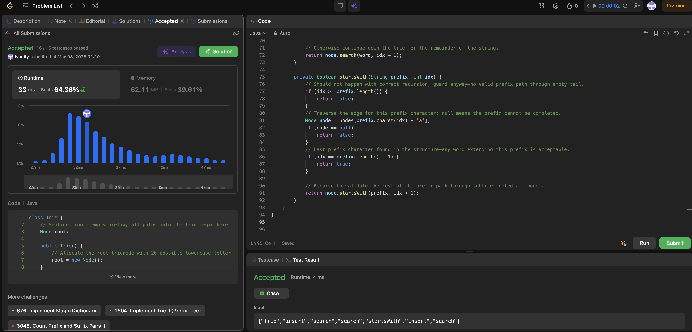

# 208. Implement Trie (Prefix Tree)

**Difficulty**: Medium<br>
**Primary Tag**: trie<br>
**Secondary Tags**: string, design<br>
**LeetCode Link**: https://leetcode.com/problems/implement-trie-prefix-tree/

---

## Problem Summary

Implement a trie with `insert(word)`, `search(word)` (exact match), and `startsWith(prefix)` (prefix match) operations, supporting lowercase Latin letters.

## Screenshot



---

## My Mistake(s)

- Stored whole strings at leaves instead of marking `isEnd`, wasting memory and breaking prefix queries.
- Returned `true` from `search` when the path existed but forgot to check `isEnd`, so prefixes incorrectly matched as whole words.
- Mentally used `HashMap<Character, Node>` but mixed up array indexing or forgot the `'a'` offset for the 26-element array.
- Confused `startsWith` with `search` and required `isEnd` at the last prefix character (wrong — `startsWith` must NOT require `isEnd`).
- Off-by-one when setting or testing `isEnd`: used `length` instead of `length - 1` as the terminal index.
- Built edges in the wrong direction or keyed children by position instead of character.
- For the recursive approach, used a global index incorrectly across calls, causing characters to be skipped or repeated.

## Key Insight

A trie is a rooted tree where each edge label is one character; paths from the root spell prefixes. Use a `Node` with `Node[] nodes = new Node[26]` (index `c - 'a'`) and a boolean `isEnd`.

- **`insert`**: walk or create nodes along the word; set `isEnd = true` on the final node.
- **`search`**: walk the path; return `true` only if the path exists **and** `isEnd` is set on the last node.
- **`startsWith`**: walk the path; return `true` as soon as the last prefix character's edge is confirmed to exist — `isEnd` is irrelevant.

Sharing prefixes saves space over storing strings naively. Each operation is O(L) time where L is the word/prefix length; space is proportional to total stored characters (bounded by the 26-way branching factor).

## Correct Approach

```java
class Trie {
    Node root;

    public Trie() {
        root = new Node();
    }

    public void insert(String word) {
        root.insert(word, 0);
    }

    public boolean search(String word) {
        return root.search(word, 0);
    }

    public boolean startsWith(String prefix) {
        return root.startsWith(prefix, 0);
    }
}

class Node {
    Node[] nodes = new Node[26];
    boolean isEnd;

    void insert(String word, int idx) {
        if (idx == word.length()) { isEnd = true; return; }
        int c = word.charAt(idx) - 'a';
        if (nodes[c] == null) nodes[c] = new Node();
        nodes[c].insert(word, idx + 1);
    }

    boolean search(String word, int idx) {
        if (idx == word.length()) return isEnd;
        Node node = nodes[word.charAt(idx) - 'a'];
        if (node == null) return false;
        return node.search(word, idx + 1);
    }

    boolean startsWith(String prefix, int idx) {
        if (idx == prefix.length() - 1) {
            return nodes[prefix.charAt(idx) - 'a'] != null;
        }
        Node node = nodes[prefix.charAt(idx) - 'a'];
        if (node == null) return false;
        return node.startsWith(prefix, idx + 1);
    }
}
```

**Time Complexity**: O(L) per operation<br>
**Space Complexity**: O(total characters × 26) worst case

---

## Practice History

| Date | Outcome | Notes |
|------|---------|-------|
| 2026-05-02 | Solved after review | Confused search vs startsWith isEnd requirement; off-by-one on terminal index |
