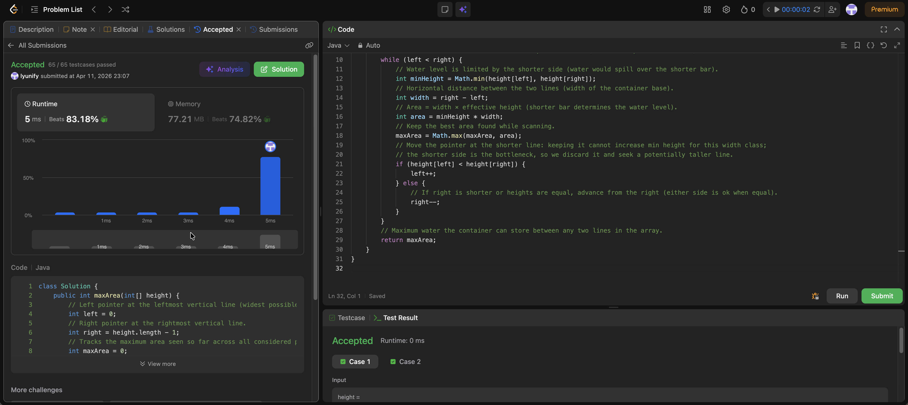

# 11. Container With Most Water

**Difficulty**: Medium<br>
**Primary Tag**: two-pointers<br>
**Secondary Tags**: array, greedy<br>
**LeetCode Link**: https://leetcode.com/problems/container-with-most-water/

---

## Problem Summary

Given an array of heights representing vertical lines, find two lines that together with the x-axis form a container that holds the most water.

## Screenshot



---

## My Mistake(s)

- Brute-forcing every pair O(n²) or using nested loops when the two-pointer approach applies.
- Moving the taller line first, hoping to fix area — that can only shrink width without guaranteeing a larger min height, so it is the wrong greedy step.
- Confusing "move the smaller index" with "move the smaller value" — it is always the pointer at the shorter bar that should advance.
- Forgetting that area depends on both width and min height, and only comparing heights without multiplying by the current width.
- Missing edge cases: array length 2 (only one container) and all equal heights (answer is still well-defined by the formula).

## Key Insight

The amount of water is limited by the shorter of the two vertical lines, so `area = width × min(left height, right height)`. Start with the widest span (`left = 0`, `right = n - 1`) and always move the pointer at the shorter line. Keeping the shorter line while shrinking width cannot beat a strategy that tries taller lines on that side. When heights are equal, moving either pointer is fine because the bottleneck is the same. This gives O(n) time and O(1) space.

## Correct Approach

1. Initialize `left = 0`, `right = height.length - 1`, `maxArea = 0`.
2. Loop while `left < right`:
   - Compute `area = (right - left) * Math.min(height[left], height[right])`.
   - Update `maxArea = Math.max(maxArea, area)`.
   - Advance the pointer at the shorter line (`left++` if `height[left] < height[right]`, else `right--`).
3. Return `maxArea`.

```java
class Solution {
    public int maxArea(int[] height) {
        int left = 0;
        int right = height.length - 1;
        int maxArea = 0;
        while (left < right) {
            int minHeight = Math.min(height[left], height[right]);
            int width = right - left;
            int area = minHeight * width;
            maxArea = Math.max(maxArea, area);
            if (height[left] < height[right]) {
                left++;
            } else {
                right--;
            }
        }
        return maxArea;
    }
}
```

**Time Complexity**: O(n)<br>
**Space Complexity**: O(1)

---

## Practice History

| Date | Outcome | Notes |
|------|---------|-------|
| 2026-04-11 | ✅ Solved after review | Was moving the taller pointer; clarified the greedy argument for advancing the shorter side |
