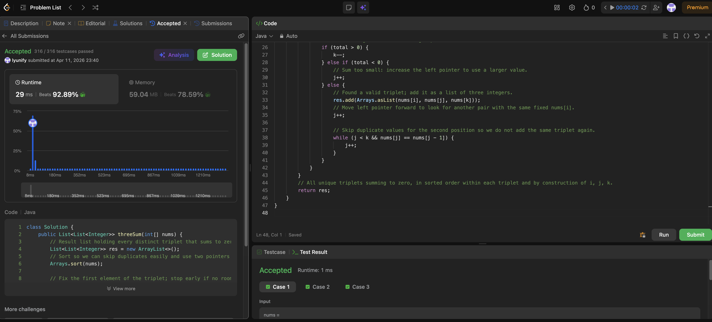

# 15. 3Sum

**Difficulty**: Medium<br>
**Primary Tag**: two-pointers<br>
**Secondary Tags**: array, sorting<br>
**LeetCode Link**: https://leetcode.com/problems/3sum/

---

## Problem Summary

Given an integer array, return all unique triplets that sum to zero (no duplicate triplets in the result).

## Screenshot



---

## My Mistake(s)

- Using three nested loops without deduplication — both TLE and duplicate triplets.
- Forgetting to sort first, so two pointers and duplicate skipping do not apply.
- Only skipping duplicates at `i` but not at `j` after a match, which repeats the same `[a, b, c]`.
- Moving both `j` and `k` after a hit without a clear rule, which can skip valid pairs.
- Mishandling edge cases: all zeros, many duplicates, or not checking `j < k` after inner skips.
- Confusing "unique triplets" with "unique indices" — dedup is value-based after sorting.

## Key Insight

Sorting turns the problem into "fix one index `i`, then two-sum for `target = −nums[i]` on the rest," enabling O(n²) with two pointers instead of O(n³) triple loops. Skip duplicate values at `i` before the inner loop, and after a hit skip duplicates while advancing `j` so each triplet is recorded once. When `total > 0` shrink `k`; when `total < 0` grow `j` — the sorted order makes this monotone.

## Correct Approach

1. Sort `nums`.
2. For each `i` from `0` to `n - 3`:
   - Skip if `i > 0 && nums[i] == nums[i - 1]` (duplicate anchor).
   - Set `j = i + 1`, `k = n - 1`.
   - While `j < k`:
     - `total = nums[i] + nums[j] + nums[k]`
     - `total > 0` → `k--`
     - `total < 0` → `j++`
     - `total == 0` → record triplet, `j++`, then skip while `j < k && nums[j] == nums[j - 1]`.
3. Return result list.

```java
class Solution {
    public List<List<Integer>> threeSum(int[] nums) {
        List<List<Integer>> res = new ArrayList<>();
        Arrays.sort(nums);
        for (int i = 0; i < nums.length - 2; i++) {
            if (i > 0 && nums[i] == nums[i - 1]) continue;
            int j = i + 1, k = nums.length - 1;
            while (j < k) {
                int total = nums[i] + nums[j] + nums[k];
                if (total > 0) {
                    k--;
                } else if (total < 0) {
                    j++;
                } else {
                    res.add(Arrays.asList(nums[i], nums[j], nums[k]));
                    j++;
                    while (j < k && nums[j] == nums[j - 1]) {
                        j++;
                    }
                }
            }
        }
        return res;
    }
}
```

**Time Complexity**: O(n²)<br>
**Space Complexity**: O(1) extra (output list not counted)

---

## Practice History

| Date | Outcome | Notes |
|------|---------|-------|
| 2026-04-11 | ✅ Solved after review | Missed j-dedup after match; clarified sort-first requirement and pointer movement rules |
