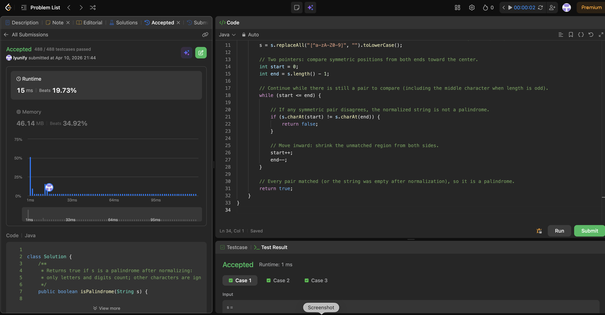

# 125. Valid Palindrome

**Difficulty**: Easy<br>
**Primary Tag**: two-pointers<br>
**Secondary Tags**: string<br>
**LeetCode Link**: https://leetcode.com/problems/valid-palindrome/

---

## Problem Summary

Given a string `s`, return `true` if it is a palindrome after converting all uppercase letters to lowercase and removing all non-alphanumeric characters.

## Screenshot



---

## My Mistake(s)

- Compared the raw string without stripping punctuation/spaces, so inputs like "A man, a plan, a canal: Panama" failed.
- Forgot `.toLowerCase()` and treated `'A'` and `'a'` as different characters after stripping.
- Used `start < end` instead of `start <= end`, mishandling odd-length strings where the middle character needs no pair.
- Doubted whether an empty string after normalization should be a palindrome (it should — the loop never runs and `true` is returned).
- Relied on `replaceAll` without recognizing it allocates a new string; an in-place two-pointer scan with `Character.isLetterOrDigit` on the original is O(1) extra space.

## Key Insight

- Normalize first, then palindrome-check: strip everything that isn't a letter or digit and lowercase — all other characters are noise.
- Two pointers from both ends: `start <= end` handles both even-length (pointers meet in the middle) and odd-length (middle character needs no pair) strings correctly.
- `replaceAll("[^a-zA-Z0-9]", "")` is concise but O(n) extra space; for O(1) extra space, skip non-alphanumerics in-place with `Character.isLetterOrDigit` on the original string.

## Correct Approach

1. Strip all non-alphanumeric characters and lowercase: `s = s.replaceAll("[^a-zA-Z0-9]", "").toLowerCase()`.
2. Initialize `start = 0`, `end = s.length() - 1`.
3. While `start <= end`: if `s.charAt(start) != s.charAt(end)` return `false`; otherwise advance both pointers inward.
4. Return `true` (every pair matched, or string was empty after normalization).

```java
class Solution {
    public boolean isPalindrome(String s) {
        s = s.replaceAll("[^a-zA-Z0-9]", "").toLowerCase();

        int start = 0;
        int end = s.length() - 1;

        while (start <= end) {
            if (s.charAt(start) != s.charAt(end)) {
                return false;
            }
            start++;
            end--;
        }

        return true;
    }
}
```

**Time Complexity**: O(n)<br>
**Space Complexity**: O(n) with replaceAll; O(1) with in-place two-pointer scan

---

## Practice History

| Date | Outcome | Notes |
|------|---------|-------|
| 2026-04-10 | ✅ | Solved after review; mistakes on ignoring non-alphanumerics, case-insensitivity, start <= end condition, empty-string edge case, and replaceAll space cost |
