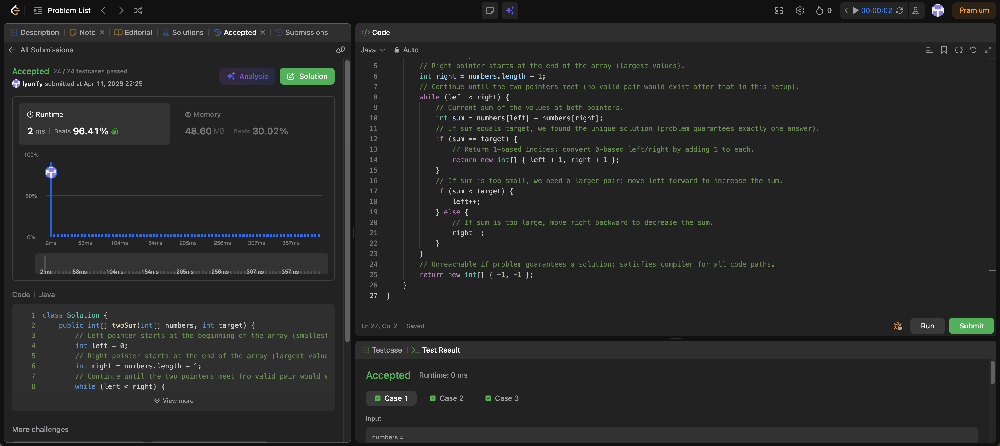

# 167. Two Sum II - Input Array Is Sorted

**Difficulty**: Medium<br>
**Primary Tag**: two-pointers<br>
**Secondary Tags**: array, binary-search<br>
**LeetCode Link**: https://leetcode.com/problems/two-sum-ii-input-array-is-sorted/

---

## Problem Summary

Given a 1-indexed sorted array, find two numbers that add up to a target and return their 1-based indices.

## Screenshot



---

## My Mistake(s)

- Confusing 0-based vs 1-based indexing and returning `[left, right]` instead of `[left + 1, right + 1]`.
- Reaching for binary search on every step or a hash map when the sorted property already supports a simpler two-pointer walk (still valid, but easy to overcomplicate).
- Forgetting that when `sum < target` you only move `left++`, and when `sum > target` only `right--` — moving both pointers at once can skip the correct pair.
- Writing a loop condition like `left <= right` and handling equality incorrectly; for this pattern, `left < right` is the usual guard until you find `sum == target`.

## Key Insight

Because the array is sorted ascending, fixing one small and one large value with two pointers gives a monotone way to adjust the sum: too small → advance `left`, too large → move `right` back. That is O(n) time and O(1) extra space, without a hash map. The statement guarantees exactly one valid pair, so no need to handle multiple matches when `sum == target`.

## Correct Approach

1. Initialize `left = 0`, `right = numbers.length - 1`.
2. Loop while `left < right`:
   - Compute `sum = numbers[left] + numbers[right]`.
   - If `sum == target`, return `[left + 1, right + 1]` (1-based).
   - If `sum < target`, increment `left` to get a larger value.
   - If `sum > target`, decrement `right` to get a smaller value.
3. Return a fallback (unreachable given problem guarantees).

```java
class Solution {
    public int[] twoSum(int[] numbers, int target) {
        int left = 0;
        int right = numbers.length - 1;
        while (left < right) {
            int sum = numbers[left] + numbers[right];
            if (sum == target) {
                return new int[] { left + 1, right + 1 };
            } else if (sum < target) {
                left++;
            } else {
                right--;
            }
        }
        return new int[] { -1, -1 };
    }
}
```

**Time Complexity**: O(n)<br>
**Space Complexity**: O(1)

---

## Practice History

| Date | Outcome | Notes |
|------|---------|-------|
| 2026-04-11 | ✅ Solved after review | Mixed up 0-based vs 1-based indexing; clarified two-pointer direction rules |
