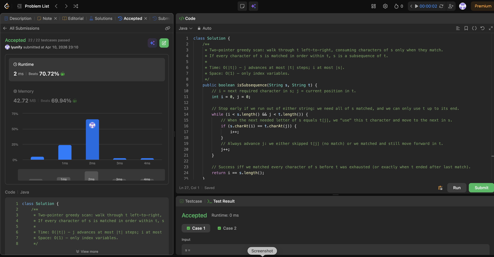

# 392. Is Subsequence

**Difficulty**: Easy<br>
**Primary Tag**: two-pointers<br>
**Secondary Tags**: string, dynamic-programming<br>
**LeetCode Link**: https://leetcode.com/problems/is-subsequence/

---

## Problem Summary

Given strings `s` and `t`, return `true` if `s` is a subsequence of `t` — i.e., `s` can be obtained from `t` by deleting some (or no) characters without changing the relative order of the remaining characters.

## Screenshot



---

## My Mistake(s)

- Confused subsequence with substring and tried to match `s` as one contiguous block inside `t`.
- Advanced both pointers only on a match and forgot to always move `j`, causing wrong results or infinite loops.
- Checked `j == t.length()` or compared lengths incorrectly instead of verifying all of `s` was consumed (`i == s.length()`).
- Doubted whether empty `s` should return `true` (it should — zero characters to match, loop may not run, `i` stays 0 and `0 == 0`).
- Used unnecessary nested loops, restarting from the beginning of `t` for each character of `s`, when one linear scan suffices.

## Key Insight

- Subsequence = same relative order, not contiguous: each character of `s` just needs to appear somewhere later in `t`.
- Single left-to-right pass with two pointers: advance `i` only on a match, always advance `j` — this simulates skipping unwanted characters in `t`.
- The answer is `i == s.length()`: all of `s` must be consumed; leftover `t` doesn't matter.
- For many queries against one fixed `t`, preprocess a next-index table per character to answer each `s` in O(|s| log |t|) instead of O(|t|).

## Correct Approach

1. Initialize `i = 0` (pointer into `s`), `j = 0` (pointer into `t`).
2. While `i < s.length() && j < t.length()`: if characters match, increment `i`; always increment `j`.
3. Return `i == s.length()`.

```java
class Solution {
    public boolean isSubsequence(String s, String t) {
        int i = 0, j = 0;

        while (i < s.length() && j < t.length()) {
            if (s.charAt(i) == t.charAt(j)) {
                i++;
            }
            j++;
        }

        return i == s.length();
    }
}
```

**Time Complexity**: O(|t|)<br>
**Space Complexity**: O(1)

---

## Practice History

| Date | Outcome | Notes |
|------|---------|-------|
| 2026-04-10 | ✅ | Solved after review; mistakes on subsequence vs substring, always advancing j, checking i == s.length(), and empty-s edge case |
